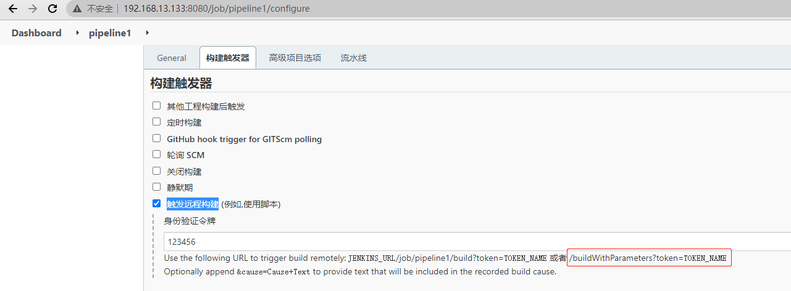
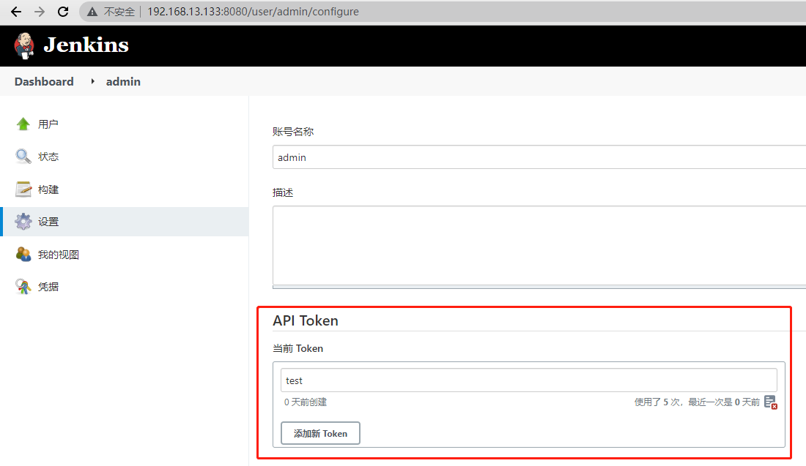

# Jenkins正常用户使用Job的远程构建

> 2022.03.03

Jenkins job设置页面可以配置“构建触发器”中的“触发远程构建 (例如,使用脚本)”。

> Enable this option if you would like to trigger new builds by accessing a special predefined URL (convenient for scripts).

> You'll need to provide an authorization token in the form of a string so that only those who know it would be able to remotely trigger this project's builds.

> This is most useful when your Jenkins instance grants read access to this job to anonymous users. When that's not the case, Jenkins will reject requests sent to the trigger URL even when the correct token is specified.

正如文档中结束，如果你不允许匿名读访问，那么即使你配置job token后，仍然需要用户身份的认证。

Job触发远程构建配置：



用户身份认证配置：




构造如下HTTP请求，即可触发远程构建

```
curl -u admin:11392235eec1a4b6175552679f431f1deb "http://192.168.13.133:8080/job/pipeline1/buildWithParameters?token=123456&pattern_source_file=123456"
```

## Jenkins的API鉴权

Jenkins 使用 Baisc Auth 的权限验证方式，需要传入 username 和 api token 。其中 api token 需要在用户的设置界面去创建。

> 补充

Jenkins的API支持如下两种方式进行认证：

用户名 + 用户密码（不安全）

以curl客户端访问为例，通过如下方式进行相关的用户认证

```
curl -u 用户名:用户密码 http://Jenkins服务的URL/具体操作的URI
```

用户名 + Token信息（安全）

以curl客户端访问为例，通过如下方式进行相关的用户认证

```
curl -u 用户名:用户Token http://Jenkins服务的URL/具体操作的URI
```

注：此处使用的Token为在Jenkins中可以查询到的(用户的配置页面可以查询到的API Token即为此处认证所使用的信息，而Token的修改也可以在此页面通过点击Change API Token按钮来进行)

Refenrence: [通过jenkins api 触发远程构建](https://www.cnblogs.com/tianleblog/p/11792977.html)