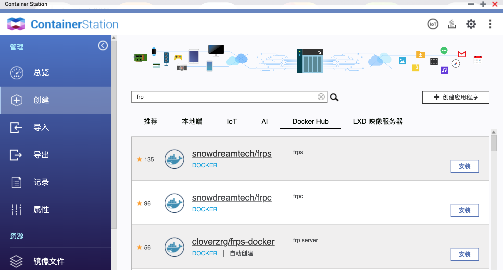
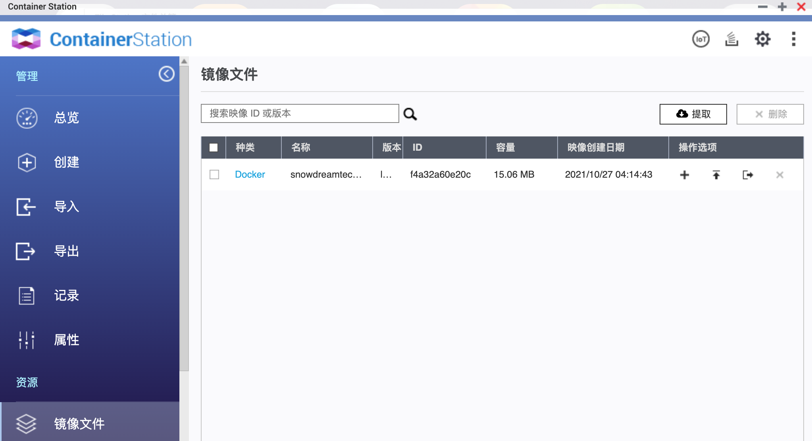
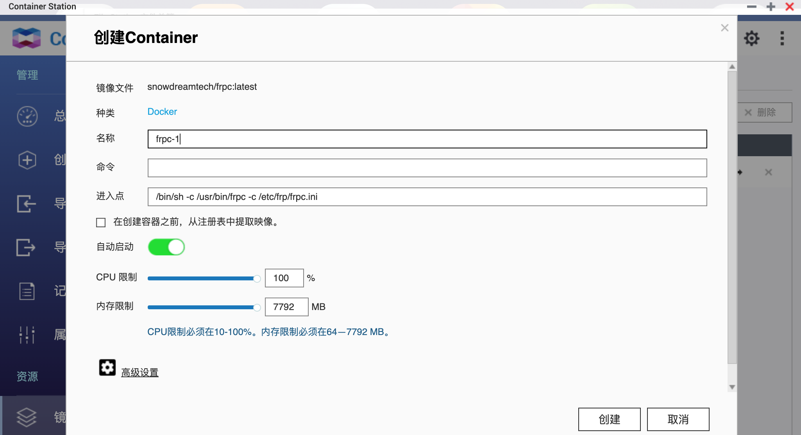
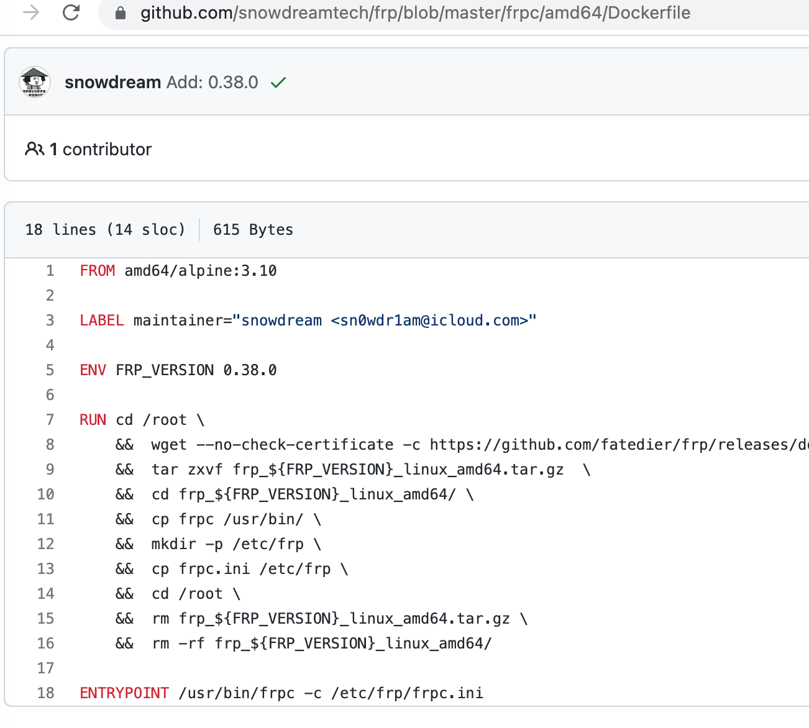
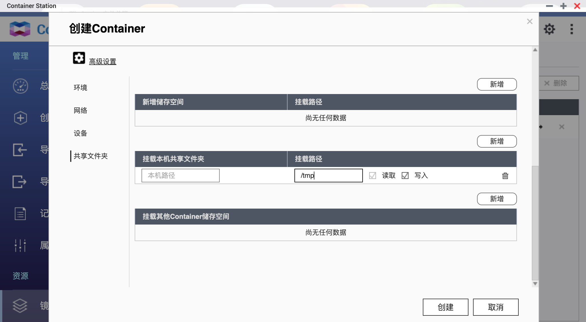
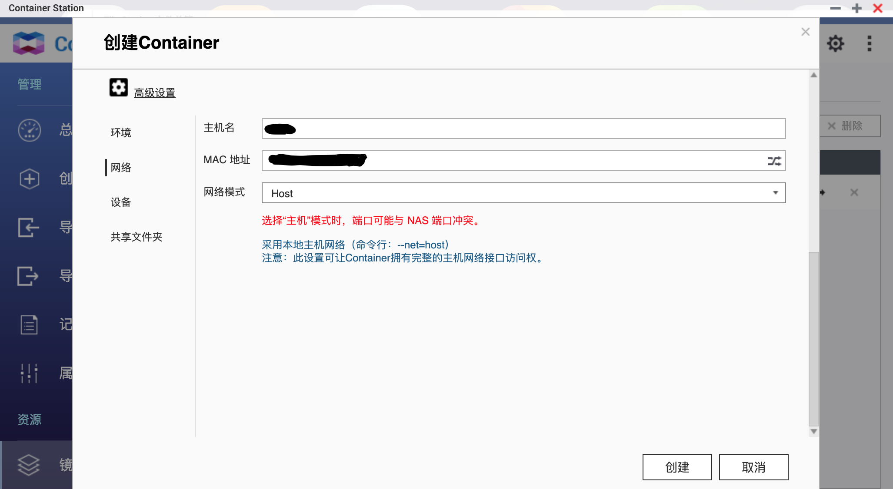

# QNAP Container Station运行frpc镜像

安装完QNAP Container后，创建容器时可以使用Docker Hub中的镜像，搜索frp，即可看到如下的镜像列表



我们直接用第二个`snowdreamtech/frpc`镜像，点击“安装”，Container Station会自动拉去镜像到本地。可以点击最下面的“镜像文件”看到



点击“安装”后，进入容器的配置页面



这里可以修改容器的名字以及限制容器可用CPU和内容的资源。其中的“命令”和“进入点”咋一看让人摸不到头脑，后来看来看snowdreamtech/frpc`的docker file，进入点应该指的是ENTRYPOINT。



这里我们可以按照docker file中的ENTRYPOINT把“进入点”改为`/usr/bin/frpc -c /tmp/frpc.ini`。
其中的`/tmp/frpc.ini`文件是我们客户端的配置文件，它在NAS的本地目录中，并不在我们的container中，所以后续还需要映射`rpc.ini`所在的本地目录到容器中(高级设置选项中)。



此处我们可以把NAS共享目录中的配置文件，挂着到容器中上一步指定的路径下面，从而使fprc可以正确读取到我们自己的配置。

最后，因为我们要代理NAS自己的登录页面，所以需要把网络设置为HOST模式，如下所示：



附件：

frpc客户端配置文件内容：

```
[common]
server_addr = serverIP
server_port = 666666
authentication_method = token
token = *****you-frps-token*****

[web]
type = http
local_port = 5000
custom_domains = customDomain
```

