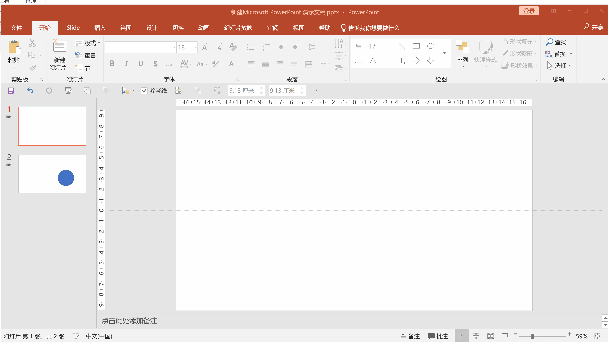

# PPT高手必会的平滑切换

> 2018-11-26

> https://post.smzdm.com/p/aoo6knqn/

此教程适用于微软PowerPoint 2016及以上的版本

## 什么是平滑切换？

如果你不知道 Keynote 中 Magic Move 是什么效果，下图是个简单演示。

Magic Move 能让两页幻灯片上的相关元素呈现平滑过渡的效果。**其实 PowerPoint 2016及以上的版本中提供了类似 Magic Move 的功能（ Office 365 的用户在更早就获得了这项功能），名字就叫"平滑"，大家可以在“切换”选项卡中找到。**由于大多数的读者可能都是PowerPoint2013及其之前的版本，或者制作者对动画关注较多，对切换关注较少，这一功能没有被充分挖掘出来。

你现在就可以打开任意一个你以前做过的 PPT，随便挑选一页，点击“切换”选项卡，选择“平滑”。（注意，一定要 Office 365 或者 Office 2016以上版本才行。）

如果不出意外的话，你会发现这波操作得到的是一个**“淡入淡出”的失败了的效果。**

前面说过，“平滑”可以让两页幻灯片中**相关的元素**呈现平滑过渡的效果。这句话的关键是**相关**。下面我们看看如何正确地使用“平滑”。

## 怎样顺利实现平滑切换？

“平滑”效果涉及两张幻灯片，一张是“平滑变换前”，一张是“平滑变换后”。现在我们选中一张幻灯片，按 Ctrl + D 进行复制（当然你也可以先 Ctrl + C，然后再 Ctrl + V）。这两张幻灯片分别是“变换前”和“变换后”，显然，这两张幻灯片目前一模一样。

现在我们修改第二张幻灯片。例如你可以删除一些你不需要的元素，改变某些字或者图形的位置、颜色、大小，也可以再加入一些其他内容。

然后再次在切换选项卡中选择“平滑”，然后点击预览。现在，两张幻灯片之间有联系的元素（复制过来，改变了大小、位置、颜色的元素）呈现了“平滑”地过渡，没有联系的元素则出现了“淡入淡出”效果。

在这里再啰嗦几句。**平滑过渡的核心还是“相关的元素”，上述的例子中，是通过复制的模式产生了相关的元素**，即“学习经历”。如果读者新建一张幻灯片，然后重新绘制一个“学习经历”，是不会达到以上效果的。但是简单的相同形状，比如矩形，圆形，软件是能自动识别的，然后会在“相关的”类似图形间平滑变化。

下面几个列子分别展示了“平滑”切换的几种用法，大家可以单独使用，也可以组合使用。

放大与缩小

旋转与拉伸

平移和放大

下面再给大家展示以上其中一个效果的制作过程，其他几个效果大家可以自行尝试。

## 如何完成矩形到圆形的平滑切换？

但是在实操的过程中，仍然有些操作不是那么直接就能实现的，最简单的比如要从矩形过渡到圆形的操作。

如果你在第一张Slide上画一个矩形，第二张Slide上画一个圆形，然后使用平滑切换，放映的效果实际上是淡入淡出，没有办法实现平滑的切换。

因此你必须要了解软件实现平滑切换的这个规则：**同种类型的形状才能实现平滑切换。**

所以只有使矩形和圆形成为同种类型的形状才行。可能吗？答案是可能的。

**PowerPoint中有一类形状称作“任意多边形”，从理论上讲，无论是矩形、圆形还是三角形都属于任意多边形。所以只要将矩形和圆形转化成任意多边形就能顺利实现平滑切换了。**

当然，利用任意多边形工具画一些直线构成的形状是比较方便的。比如你只要在拟绘制直线的起点和终点各点击一下鼠标就能形成一条直线。如果整个过程中按住shift键，则可以实现水平或者垂直直线的绘制。应用这个方法一般的矩形还是蛮简单的。但是要绘制正方形还是有些困难的。当然，你可以先用矩形绘图按钮绘制一个正方形（按住shift键绘制），然后再用任意多边形工具进行描摹。同样的，读者们如果要用任意多边形绘制工具把圆形、正五角星等形状绘制出来，还是有一些难度的。

这里可以使用PowerPoint中的另一个功能。**格式下的“合并形状”**功能。这实际上就是所谓的“布尔运算”，包括结合、组合、拆分、相交和剪除四种合并方式。关于合并形状我们将会在后续的文章中为大家具体介绍。今天的这篇文章，读者只要跟着简单做几个操作就可以了。本篇文章的目的是要使某种特定形状变成“任意多边形”，然后实现平滑切换。

我们可以在矩形中再画一个矩形，然后选中这两个矩形，点击格式→合并形状→结合，这时在格式→选择窗格中可以看到矩形已经变成了任意多边形。

应用同样的方法，圆形也可以变成任意多边形。

这时候我们把两页的切换方式都设置为平滑切换。点击从头放映，你就能发现这两个形状之间成功实现了平滑切换。

其实从矩形到圆形的平滑切换还有别的方法。比如应用“圆角矩形”这个形状，调节黄色的点，两个极限就是矩形和圆形。但是要实现矩形到五角形，用上面介绍的方法是可以实现的，这个方法的通用型更强，可以实现任意形状间的平滑切换。

## 创意满满

会了这一波操作，你可以实现更酷的功能，比如Dribbble 上一个很精彩的演示，大家可以借鉴一下。

上面的这个例子很精彩，但实际上是需要花大量的时间去创意和制作的。我觉得在比较初级的阶段，应用平滑切换最大的好处是保持幻灯片的整体流畅性，使每一个元素的出现都与上一页有联系。比如在目录页的制作上，我们就可以考虑用这一功能实现演示文稿的整体流畅性：

《完》
