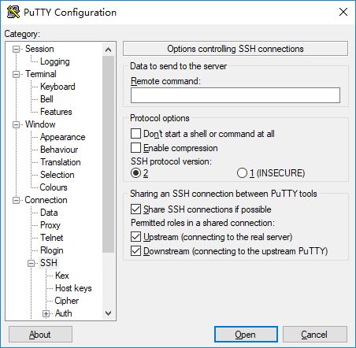

## Putty如何直接和远程服务器传输文件

> 2019.02.16

### Putty VS SecureCRT/XShell

使用SecureCRT或XShell登录远程服务器时，因为SecureCRT支持串口的XMODEM，YMODEM和ZMODEM传输协议。如果远程机器上安装有`lrzsz`软件，在SecureCRT创建的SSH会话中，可以非常方便的使用`rz`命令将本地文件上传到远程服务器上。使用`sz`命令可以非常方便的下载远程服务器上的文件到本地机器。

> `sz` uses the ZMODEM, YMODEM or XMODEM error correcting protocol to send one or more files over a dial-in serial port to a variety of programs running under PC-DOS, CP/M, Unix, VMS, and other operating systems.

> `rz` uses error correcting protocols to receive files over a dial-in serial port from a variety of programs running under PC-DOS, CP/M, Unix, and other operating systems.  It is invoked from a shell prompt manually, or automatically as a result of an "sz file ..." command given to the calling program.

但是，Putty客户端并不支持上述三个串口传输协议，即使服务器上安装有`lrzsz`软件，也无法直接使用`rz`和`sz`命令传输文件。

> There's no way to initiate a file transfer back to/from local Windows from a SSH session opened in PuTTY window.

> Though PuTTY supports connection-sharing.

> While you still need to run a compatible file transfer client (pscp or psftp), no new login is required, it automatically (if enabled) makes use of an existing PuTTY session.

> To enable the sharing see: [Sharing an SSH connection between PuTTY tools.](https://documentation.help/PuTTY/config-ssh-sharing.html)

> From: https://stackoverflow.com/questions/22127092/how-to-download-a-file-from-my-server-using-ssh-using-putty-on-windows

所以，目前版本的PuTTY并不支持类似SecureCRT那样方便的传输文件（可以预见，PuTTY也不打算支持这些协议）。你可以使用`WinSCP`或PuTTY的`pscp`或`psftp`来和远程机器传输文件。

> 注意： 目前，存在[ExtraPuTTY : xmodem](http://www.extraputty.com/features/xmodem.html)项目实现了类似SecureCRT的操作方式，不过维护的人非常少，不建议使用。


### pscp.exe

`pscp.exe`是支持SCP传输的命令行工具，如果PuTTY保存的会话（Session）允许共享SSH连接，那么`pscp.exe`可以使用PuTTY已经建立的连接（避免重新输入密码）。例如，列出远程指定目录文件命令如下：

```
pscp.exe  -load 保存的PuTTY会话名称 -ls 远程主机IP:远程目录路径
```

具体的配置方式，请参考下面小结。个人感觉，使用`pscp.exe`还不如WinSCP方便，不过`pscp.exe`作为一种备用方式，方便用脚本处理，也是不错的选择。


### Sharing an SSH connection between PuTTY tools



The controls in this box allow you to configure PuTTY to reuse an existing SSH connection, where possible.

The SSH-2 protocol permits you to run multiple data channels over the same SSH connection, so that you can log in just once (and do the expensive encryption setup just once) and then have more than one terminal window open.

Each instance of PuTTY can still run at most one terminal session, but using the controls in this box, you can configure PuTTY to check if another instance of itself has already connected to the target host, and if so, share that instance's SSH connection instead of starting a separate new one.

To enable this feature, just tick the box ‘Share SSH connections if possible’. Then, whenever you start up a PuTTY session connecting to a particular host, it will try to reuse an existing SSH connection if one is available. For example, selecting ‘Duplicate Session’ from the system menu will launch another session on the same host, and if sharing is enabled then it will reuse the existing SSH connection.

When this mode is in use, the first PuTTY that connected to a given server becomes the ‘upstream’, which means that it is the one managing the real SSH connection. All subsequent PuTTYs which reuse the connection are referred to as ‘downstreams’: they do not connect to the real server at all, but instead connect to the upstream PuTTY via local inter-process communication methods.

For this system to be activated, both the upstream and downstream instances of PuTTY must have the sharing option enabled.

The upstream PuTTY can therefore not terminate until all its downstreams have closed. This is similar to the effect you get with port forwarding or X11 forwarding, in which a PuTTY whose terminal session has already finished will still remain open so as to keep serving forwarded connections.

In case you need to configure this system in more detail, there are two additional checkboxes which allow you to specify whether a particular PuTTY can act as an upstream or a downstream or both. (These boxes only take effect if the main ‘Share SSH connections if possible’ box is also ticked.) By default both of these boxes are ticked, so that multiple PuTTYs started from the same configuration will designate one of themselves as the upstream and share a single connection; but if for some reason you need a particular PuTTY configuration not to be an upstream (e.g. because you definitely need it to close promptly) or not to be a downstream (e.g. because it needs to do its own authentication using a special private key) then you can untick one or the other of these boxes.

**I have referred to 'PuTTY' throughout the above discussion, but all the other PuTTY tools which make SSH connections can use this mechanism too. For example, if PSCP or PSFTP loads a configuration with sharing enabled, then it can act as a downstream and use an existing SSH connection set up by an instance of GUI PuTTY. The one special case is that PSCP and PSFTP will never act as upstreams.**


### XMODEM, YMODEM, and ZMODEM

> http://web.cecs.pdx.edu/~rootd/catdoc/guide/TheGuide_226.html

This section deals with uploading and downloading files from you home computer over a modem. Two programs will be illustrated: `sx` `sb` `sz` , and `kermit`.

`Sx` `rx`, `sb` `rb`, and `sz` `rz` implement the xmodem, ymodem, and zmodem file transfer protocols respectively.

#### XMODEM

Xmodemis one of the most widely used file transfer protocols. The original Xmodem protocol uses 128-byte packets and a simple "checksum" method of error detection. A later enhancement, Xmodem-CRC, uses a more secure Cyclic Redundancy Check (CRC) method for error detection. Xmodem protocol always attempts to use CRC first. If the sender does not acknowledge the requests for CRC, the receiver shifts to the checksum mode and continues its request for transmission.

Xmodem-1K

Xmodem 1K is essentially Xmodem CRC with 1K (1024 byte) packets. On some systems and bulletin boards it may also be referred to as Ymodem. Some communication software programs, most notably Procomm Plus 1.x, also list Xmodem-1K as Ymodem. Procomm Plus 2.0 no longer refers to Xmodem-1K as Ymodem.


#### YMODEM

Ymodem is essentially Xmodem 1K that allows multiple batch file transfer. On some systems it is listed as Ymodem Batch.

Ymodem-g

Ymodem-g is a variant of Ymodem. It is designed to be used with modems that support error control. This protocol does not provide software error correction or recovery, but expects the modem to provide the service. It is a streaming protocol that sends and receives 1K packets in a continuous stream until instructed to stop. It does not wait for positive acknowledgement after each block is sent, but rather sends blocks in rapid succession. If any block is unsuccessfully transferred, the entire transfer is canceled.


#### ZMODEM

Zmodem is generally the best protocol to use if the electronic service you are calling supports it. Zmodem has two significant features: it is extremely efficient and it provides crash recovery.

Like Ymodem-g, Zmodem does not wait for positive acknowledgement after each block is sent, but rather sends blocks in rapid succession. If a Zmodem transfer is canceled or interrupted for any reason, the transfer can be resurrected later and the previously transferred information need not be resent.

The fallowing are small examples on how this programs can be used. These commands are executed on the UNIX machine first, and then the appropriate option is selected on your PC to start the transfer. The following are examples of these commands using the xmodem protocol. The other protocols can be used the same way.

```
sx file1
send text file file1, using the xmodem protocol
sx -b file2
send binary file file2, using xmodem
rx
receive a text file using xmodem
rx -b file3
receive a binary file, file3, using xmodem
```

Reference：

[How to download a file from my server using SSH (using PuTTY on Windows)](https://stackoverflow.com/questions/22127092/how-to-download-a-file-from-my-server-using-ssh-using-putty-on-windows)

[Sharing an SSH connection between PuTTY tools](https://documentation.help/PuTTY/config-ssh-sharing.html)

[XMODEM, YMODEM, and ZMODEM](http://web.cecs.pdx.edu/~rootd/catdoc/guide/TheGuide_226.html)