### 教你怎么PC电脑正确播放4K HDR电影【potplayerr播放器+madVR渲染方法】

> 2017-5-3 14:24

> http://www.hangge.com/blog/cache/detail_1461.html

如果观看4K HDR视频和电影的时候，使用不正确的方法观看时，画面惨白惨白的，简直一塌糊涂，不知道人还以为是片源有问题呢。下面这图应该是很多用户会遇到的情况。

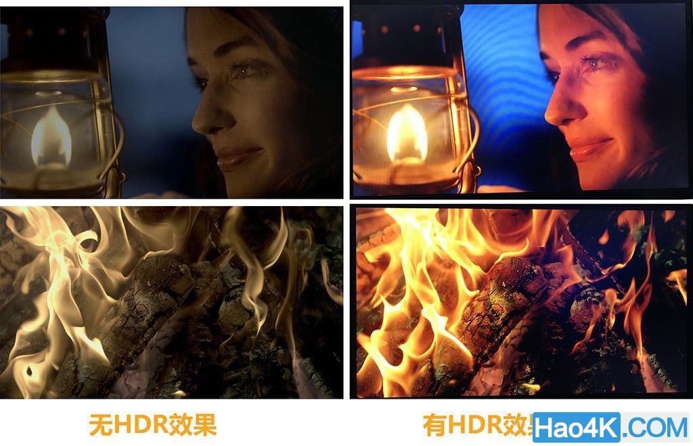

HDR片源正确播放和非正确播放对比图。

#### 如何判断视频是否支持HDR

要确定这到底是不是一部真正的HDR视频，这时我们需要Mideainfo这个软件，这里也建议直接安装Klite Code Pack 的Mega版本，里面包含的不少东西像LAV和MadVR后面会用到。

Mideainfo可以直接从[官网https://mediaarea.net/en/MediaInfo](https://mediaarea.net/en/MediaInfo)下载。以惊奇队长WEB DL的版本为例，MKV文件右键选择MediaInfo：

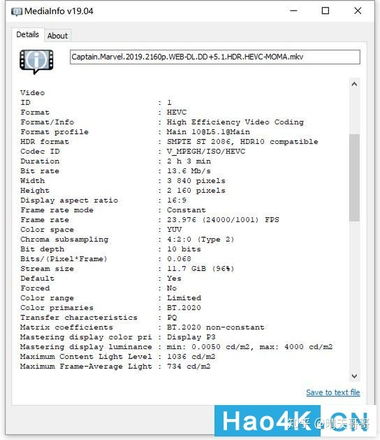

当看到HEVC编码、HDR10、PQ、10bit、BT.2020这些描述，就可以断定是一部HDR10格式的UHD视频了，而且能看到最高画面亮度需求为1036nit。拿到这样的片子，肯定是先拿到电脑上播放，结果......咦？怎么颜色这么淡呢？

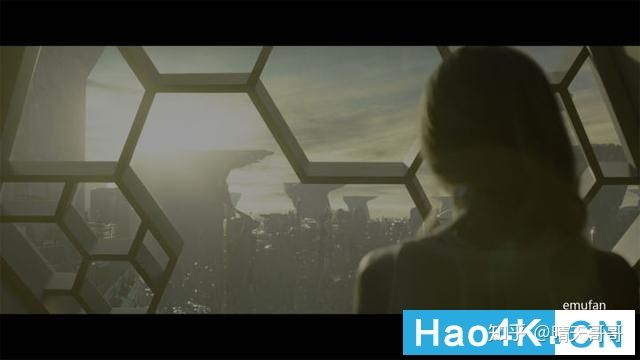

这种情况是大多数常规播放器（诸如potplayer、KMplayer等软件）渲染器使用常规滤镜所导致，至于解决办法就是下面介绍的madVR滤镜。

#### madVR介绍

potplayerr播放器+madVR渲染。madVR支持读取片源里的HDR信息，然后把颜色重新映射在SDR屏幕上，模拟HDR的效果。

- madVR 是一款超强的视频插件，其配合高清播放软件，可以做到目前 PC 上播放高清视频的最强画质。

- madVR 这款视频渲染器比市面上大多数播放器自带的渲染器有着更精确的颜色处理，更高质量的图像缩放缩放、以及更低的颜色错误率。这就使得它所渲染出来的视频在颜色上更趋于真实，在画质细节上也要强于其他渲染器。

- madVR 支持各类显卡，包括 NVIDIA 和 AMD 的独显以及英特尔的核芯显卡。不过用户在使用 madVR 渲染视频时，会占用大量的 GPU 资源和 CPU 资源。

#### madVR的使用

这里我们以 Potplayer 这款播放器为例，演示如何使用 MADVR 进行视频渲染。

##### 1. 安装Potplayer播放器

（1）官网地址：http://potplayer.daum.net/

（2）安装的时候记得勾选“安装额外编解码器”。Potplayer 便会自动下载一些编解码器。

（3）下载好的编解码器要全部打勾。然后结束安装。

##### 2. 安装LAV Filters解码器

（1）GitHub 地址：https://github.com/Nevcairiel/LAVFilters/releases

（2）这里我们只需要安装 64 位的视频解码器就可以了。

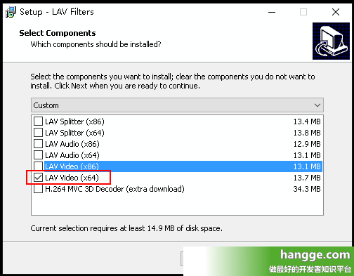

##### 3. 安装MADVR渲染器

（1）官网地址：http://www.madvr.com/
（2）将 MADVR 渲染器放在一个没有英文名的路径下。然后又键点击“install.bat”，选择“以管理员身份运行”，便完成 MADVR 的安装了。

##### 4. Potplayer设置

（1）启动 PotPlayer 后，按下 F5 打开“选项”窗口。点击“滤镜”，关闭 Potplayer 内置图像滤镜。 

> 这样做防止 Potplayer 对视频进行瞎处理。比如播放 10-bit 视频，如果不关闭内置滤镜的话，数据在传递给 madVR 前已经从 10-bit 砍成 8-bit 损失精度，madVR 内部再怎么精度高也是白搭。

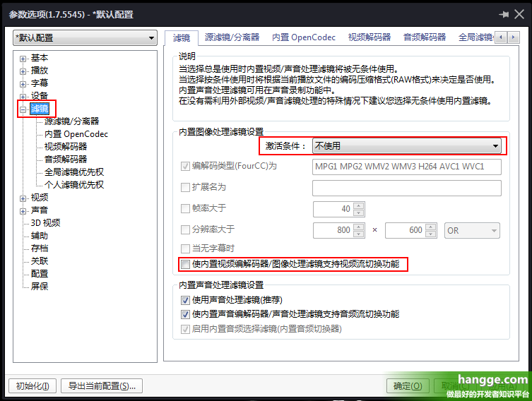

（2）点击“滤镜”->“全局滤镜优先权”->“添加系统滤镜”。找到 LAV Video Decoder 和 madVR，并添加进来。

（3）同时还要把添加的这两项优先顺序改称“强制使用”。

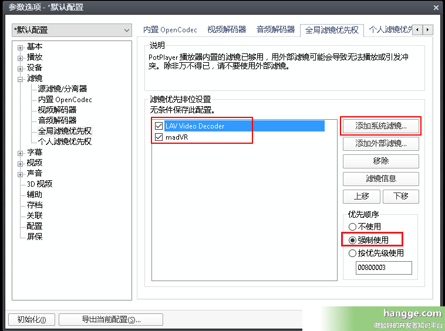

（4）随便播放一个视频。按 Tab 键即可看视频的解码和渲染是不是 LAV 和 MADVR，如果是的话就说明设置正确了。同时可以发现虽然我的电脑是集显，帧率也提升了一倍多。

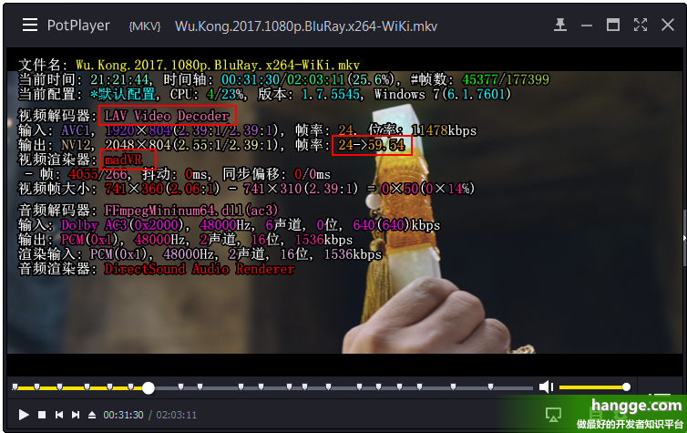

##### 5. MADVR简易设置

（1)我们双击任务栏右下方的 MADVR 控制面板，进入设置菜单。（没有的话运行 MADVR 文件夹里的 madHcCtrl.exe）

（2）在“devices”这个选项中，不过我们使用的是显示器还是电视，一律选择“Digital Monitor/TV”。

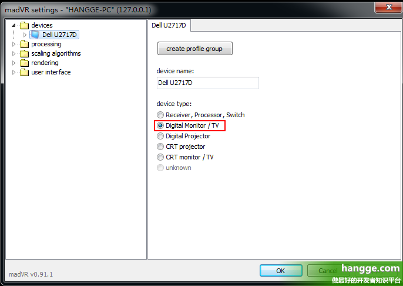

（3）打开设备下的“properties”选项。

如果使用显示器，第一项 RGB 范围选择 0-255。如果是连接电视机，则选择 16-255。（这个还是比较测试下，我接电视反而感觉选 0-255 效果更好）
第二项是色深。一般选择 8bit。如果显示器或者电视能达到 10bit 或更高，则选择 10bit。

#### MADVR的高级设置技巧

我们打开 MADVR 文件夹中的 madHcCtrl.exe，这个便是 MADVR 的控制面板。下面对画质起关键作用的几个选项，分别进行介绍。

##### 1. processing菜单

（1）deinterlacing 选项，对应的是图像交错处理。

建议在最上面的选项打勾，让视频需要进行图像交错的时候交给 MADVR 自己去处理，并且在怀疑时不启动交错处理。
如果常看动漫的，可以去掉“only look at pixels in the frame center”勾选。

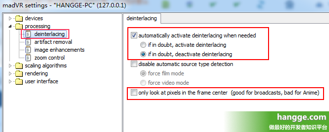

> 关于“only look at pixels in the frame center”：

>> "only look at pixels in the frame center"这个选项只对film型式的交错式(隔行扫描interlaced)影片有影响，也就是说这选项在启动madVR的film mode时才有作用(文后有解释)

>> 我们知道对于这类影片必须对其作IVTC让它还原成24p(60i→24p)，但实际上我们有时候会发现录了一部电视播放的电影或动画下来，电视台常常在四边打上跑马灯或台标之类的东西，而这个跑马灯或台标却是video型式的interlaced讯号(真正的60i 无法IVTC)，因此我们要作IVTC时如果是对整个画面的像素作侦测，遇到这种情形时就很容易产生误判。因此勾选这个选项时就只会对画面中央部分的像素 作侦测，避开那些跑马灯或台标可能出现的位置以免作IVTC时产生误判，但缺点就是这样侦测的效率较低，遇到动画这类常常有静止画面的影片在侦测是哪一类 pulldown时就会花比较久的时间。如果会看电视台播放的电影或动画的话，建议勾选此选项，如果是看DVD原盘的话，则建议取消勾选。

>> 这选项对progressive的影片完全没有影响，如果照字面理解为这选项不利于动画的话那是错误的理解，因为很多动画片源只要是蓝光或是录制下来压制时做过IVTC的，都会是progressive而非interlaced。电视台录制下来的原始TS档或是DVD原盘才有可能是interlaced。

（2）arifact removal 选项，对应的是图像去色阶功能。

在普通的视频中，我们经常会看到人物的脸上，或者不同颜色的交界处有淡淡的光晕和条纹，这就是没有去掉色阶。而我们的目的就是让图像的颜色过渡更加自然，让条纹现象减少甚至消失。（这个选项会占用一些 GPU 资源，但尚可接受，开启无压力。）

第一个选项是整体画面的去色阶效果。一般选择 low 就会有不错的效果。

第二个选项是不同颜色交界处去色阶效果。可以选择 high。

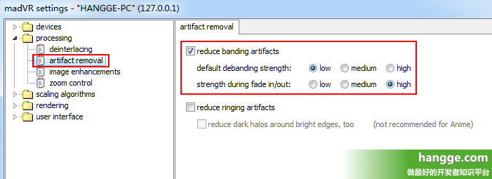

##### 2. scaling algorithms菜单

这个是最关键的图像缩放算法的设置，这部分是影响效能最大也是影响画质表现最明显的地方，也是 madVR 的最大特色。

里面4个页面的内容基本类似。让用户选择的东西都是各种图像缩放模式，而不同的模式所消耗的性能也是不同的，基本上从上到下，性能消耗是越来越大，用户要根据自己的配置来考虑。

每个页面的设置主要都是为了解决视频图像中的锯齿（aliasing）和振铃效应（ringing）。

根据选择的不同，右上角会有效果介绍。绿条一般越长也越好。红条则是越低越好。

（1）chroma upscaling：色度拉升

即色度平面放大。不过色度拉伸的算法比较难感受到差别。

如果配置好的话就设置是 NGU Anti-Alias,high quality（这里开到 very high qulity 以上几乎没什么意义，肉眼分辨不出）

如果显卡中等的话，可以设置 Jinc + AR

如果显卡不太好的话，则可设置 Cubic Bicubic75 + AR 

如果是 Intel 集显得话，则可设置 Cubic SoftCubic60 + AR

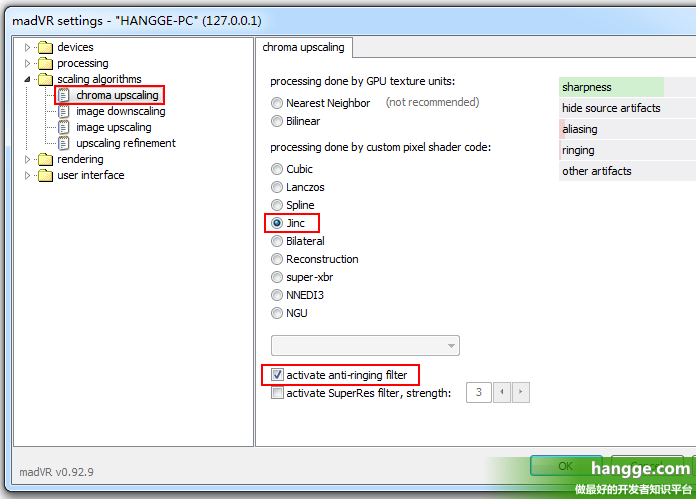

（2）image downscaling：影像缩放

只要输出分辨率小于原始分辨率就会用到这部分的算法，比如 4K 分辨率的视频在 1080P 显示器上播放。

如果电脑配置特别高的话，还可以考虑下使用 SSIM 1D 100%。SSIM 是目前表现最好的算法，在缩小画面的同时很好的保留了原解析度的细节跟锐利度，不过效能消耗也比较大。

如果显卡跑不动 SSIM 的话，可以考虑 Cubic（Bicubic 150）+ AR + LL，即勾选“activate anti-ringing filter”(简称 AR)跟”scale in linear light”（简称 SC）。

如果显卡还是不给力，那就使用下图的 Cubic（Catmull-Rom）+ AR + LL，这个也算是公认的最佳演算法组合(resize 后最接近原本的画面）

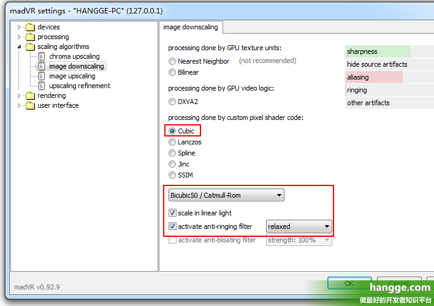

（3）image upscaling：影像拉升

也就是影像放大，只要输出目标分辨率大于原始分辨率就会用到这部分的算法，比如 1080P 分辨率的视频在 4K 显示器上播放。

在这里我们可选择使用 doubling（影像翻倍）或 upscaling（影像拉升）。前者效果比后者好很多，所以说能开的话还是开一下吧。（当然如果显卡不是很好的话，就不要使用 doubling 了）

对显卡很有自信的可以开 NGU Anti-Alias，同时下拉框设置为下图所示。

> 这里注意第四个下拉框（activate doubling）的选项：

>> 我们这里选择的是“... always -supersampling”，表示始终启用 NGU 进行翻倍。

>> 而原来默认的“let madVR decide”表示目标分辨率的宽或高大于或等于原始分辨率 1.2 倍时才启用 NGU，沒达到 1.2 倍启用条件的话则会使用 Jinc + AR 替代。

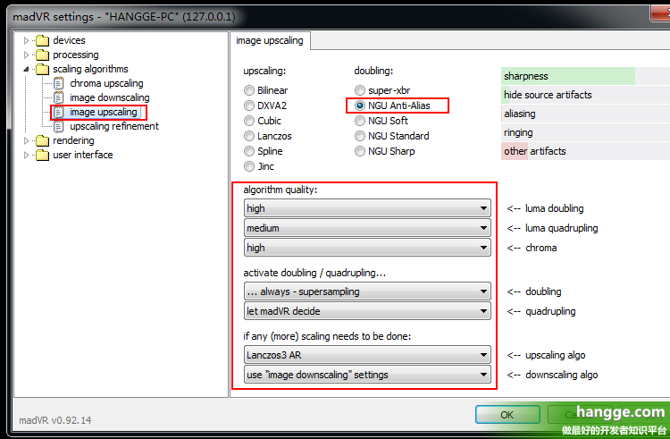

如果上面的设置有些吃力的话，可以把第一个下拉框（luma doubling）的选项调成 medium。

如果配置中等的话，还是建议设置为 upscaling 下的 Jinc + AR。

显卡吃不消的可以考虑：Lanczos 4+AR（HD4600 等级集显）甚至是 Cubic Bicubic60+AR（HD4000 等级集显）。

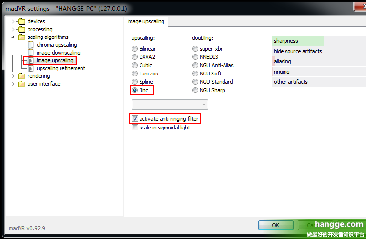

（4）upscaling refinement：锐化算法

目的是在于改善放大运算后造成的模糊，只在视视频大后使用。

### 如何判断设置是否适合

在播放不卡顿的前提下，我们选择尽量高的设置。是否卡顿可以这么判断：

- 可以使用 fraps 查看帧率，全屏模式下应该是等于你显示器刷新率，窗口模式下一般是输出帧率。

- 也可以用 GPU-Z 查看 GPU 负荷，不到 90% 什么的基本就没问题了

Reference： [分享在PC/电脑上播放4K HDR电影/视频的正确方式](https://zhuanlan.zhihu.com/p/72238274)

[实现PC视频播放最强画质教程( Potplayer播放器+MADVR插件)](http://www.hangge.com/blog/cache/detail_1461.html)

[教你怎么PC电脑正确播放4K HDR电影【potplayerr播放器+madVR渲染方法】（新手必看](https://www.hao4k.cn/thread-9349-1-1.html)

《完》
