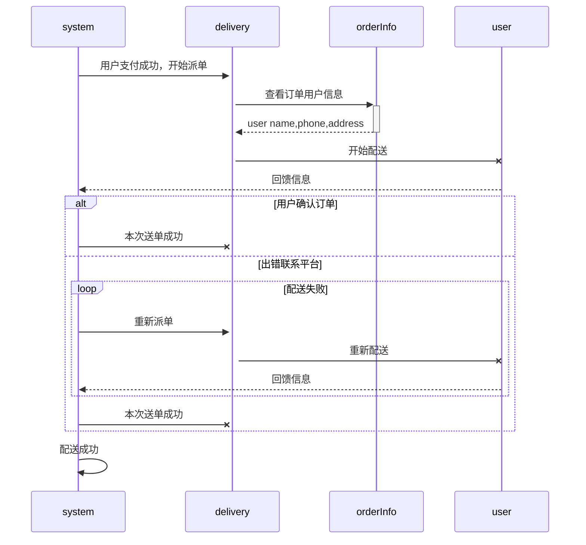

# VSCode支持Markdown流程图时序图等

## Markdown Preview Enhanced 插件

除了常规的功能外，特别要提出的是两个功能：

1. 图像

Markdown Preview Enhanced 内部支持 mermaid, PlantUML, WaveDrom, GraphViz，Vega & Vega-lite，Ditaa 图像渲染。

你也可以通过使用 Code Chunk 来渲染 TikZ, Python Matplotlib, Plotly 等图像。

2. Code Chunk

Markdown Preview Enhanced 支持渲染代码的运行结果!!!!!!!!

它唯一的问题就是会让VSCode多出来一个预览图标

## Markdown Preview Mermaid Support 插件（推荐）

Adds Mermaid diagram and flowchart support to VS Code's builtin markdown preview

这个插件的好处在于，可以直接使用VSCode自己的预览图标来渲染流程图。样例mermaid流程图如下：



线条语法：
```
->   表示无箭头的实线 
->>  有箭头实线 
-->  无箭头的虚线 
-->> 有箭头的虚线 
-x   末尾有x的实线（异步） 
--x  末尾无x的实线
```

更多语法细节可以参考：

[Mermaid之时序图语法](https://blog.csdn.net/qq_37196887/article/details/112764646)

[mermaid之序列图](https://blog.csdn.net/qq_36221177/article/details/95526818)

[用mermaid写sequenceDiagram](https://blog.csdn.net/qq_43179428/article/details/104888572)