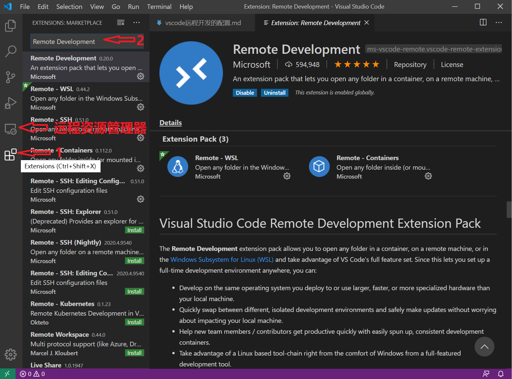

## vscode远程开发的配置

> From: https://zhuanlan.zhihu.com/p/93239107

### 第一步：安装插件

配置远程开发首先需要安装一个名为`Remote Development`的插件，具体操作步骤如下，

- 点击扩展按钮
- 搜索`Remote Development`
- 安装



### 第二步：配置远程服务器

安装插件之后，点击远程资源管理器，在SSH TARGETS配置远程服务器，具体步骤如下，

- 点击齿轮图标
- 打开弹出的config文件
- 分别配置Host、Hostname、User以及IdentityFile

这里需要注意一个，Host是一个名称，自己可以随意命名。Hostname是远程服务器的IP，User是用于登录远程服务器的账户名称。IdentityFile是登录私钥，如果仅使用密码登录，可以不配置该项目。

```
Host master
    HostName 192.168.1.210
    User dr
    IdentityFile C:\Users\liang\.ssh\id_rsa
```

### 第三步：修改设置

打开vs code设置，搜索`Show Login Terminal`，勾选下方"Always reveal the SSH login terminal"，记得一定要操作这一步，不然会一直提示报错。

### 第四步：打开远程连接窗口

把鼠标放在上一步配置的远程连接条目上，点击`Connect to Host in New Window`，然后就会在新的窗口打开我们想要的远程连接。

## 辅助插件

一款工具，单凭它自带的工具，是很难满足不同人群的需求的，因此，插件就成了一个不可或缺的部分。通过适当的插件配置能够让一款看似平淡无奇的工具瞬间变的丰富强大起来。我认为vs code的优势之一就是它丰富的插件及便捷的配置方式，在这里，推荐5款个人认为不错的vs code插件。

#### TabNine

当然首推还是这一款基于GPT-2语言模型的自动补全工具，我在前面一篇文章中花了一篇文章对这款插件进行了介绍。在这里，我再次强烈推荐TabNine这款插件，哪怕你使用的不是vs code也可以尝试一下这款插件。

TabNine和我认识中的自动补全工具有很大的不同，传统的补全工具更多的是根据上下文信息和第三方库进行补全，换句话说就是基于既有的内容进行补全。而TabNine更多的是偏向推理，它能够根据开发者前面输入的内容快速推理接下来要输入的代码，甚至参数、字符串、符号它都能够准确的推理并补全。

#### Bookmarks

我们在开发过程中会经常进行跳转或者翻页，当经过一系列的跳转之后想回到最初的位置却发现无从下手了。在使用Pycharm时，可以通过快捷键给代码添加上标签，当我们想回到某一个位置时能够使用快捷键或者搜索的方式快速定位到准确的位置，这也是Pycharm吸引我的地方之一，它也养成了我喜欢打标签的习惯。

刚从Pycharm迁移到vs code在标签这一块会很不习惯，发现总是忘记之前所在代码片段。最后发现，vs code也可以通过配置插件实现强大的标签功能，这款插件就是Bookmarks。我们能够使用Ctrl+Alt+K、Ctrl+Alt+J、Ctrl+Alt+L快捷键添加标签，并且可以快速调整到指定标签位置。

#### GitLens

多人开始过程中，版本管理工具是必不可少的，其中使用较多的就是Git。它在日常开发中占据着非常重要的地位，因此版本管理在大多数开发工具中都是必备的功能之一。我之前一直使用Pycharm，我认为它在版本管理方面已经做的很好了，但是，经过一段时间试用GitLens之后才发现，Pycharm在Git版本管理方面对比于GitLens真的是相差甚远。

它能够清晰的显示当前文件 的修改时间、修改历史，能够可视化分支、作者、commit等信息，提供便捷而强大的对比功能。

#### TODO Highlight

我们在开发过程中，有时会为了测试或某种原因，某段代码需要之后进行修改和完善。如果就不做一些标记，时间久了、需要修改的多了，就很难区分出哪些是需要修改的、哪些是不需要修改的。因此养成做标记的好习惯对提升开发效率具有很大的帮助。

在开发过程中常用的待办标记有TODO和FIXME，在Pycharm中当我们使用这两个标记时它能够自动对其进行高亮显示，这样对于我们找到标记处非常方便。vs code可以通过安装TODO Highlight插件来实现，这样能够突出显示我们还有哪些内容有待完善，能够避免我们检查代码过程中遇到的麻烦。