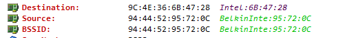
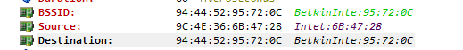
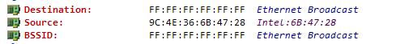
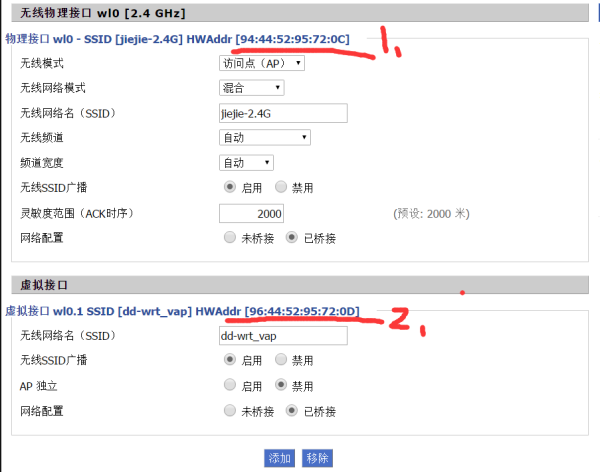

### SSID、BSSID、ESSID区别？

> From: [知乎](https://www.zhihu.com/question/24362037)

SSID = Service Set IDentifier

BSSID = Basic Service Set IDentifier

ESSID = Extended Service Set IDentifier

关于SSID比较好理解，故我们只关心下BSSID和ESSID的问题。

从简单意义上而言，BSSID在某些情况下是等价于MAC地址的。不过从细节上而言，这里还有一些内容需要讨论。

** 如果在一个基础架构网络中，该BSSID的默认是对应的网卡的MAC地址，如果增加出来的虚拟BSSID就是在其对应MAC地址上进行增加。如果在一个IBSS网络（也就是Ad-hoc）模式，BSSID是一个随机值，与本地MAC地址无关。 **

首先我们先返过来看MAC地址，在MAC地址构成上，前24位厂家号（IEEE分配），后24位有厂家定义的具体序号（厂家分配）。不过在具体的交换机中，我们需要知道，交换机有一个基准的MAC地址，然后每一个接口还有其对应的MAC地址。如果对STP协议比较熟悉的话，知道STP协议中计算根交换机过程中所用的BID中是包含MAC地址的，该MAC地址对应的就是基准MAC地址，而不是接口MAC地址。按照目前所知道的应该是，交换机有一个基准的MAC地址（可以在外壳上看到，或者采用show version查看），然后每一个接口上的MAC地址是通过这个基准MAC地址计算出来的（类似采用+1之类的方法，具体还有些不清楚）。

然后我们需要反过来看AP上的地址。我们首先需要知道，如果是瘦AP的话，需要用有线连接到AC，同时用无线连接到客户端上的。那么这里就有有线和无线两个环节。有线中一定会有一个MAC地址，而无线中没有MAC地址的概念，取而代之的就是BSSID。故这里存在一个疑问，该MAC地址和BSSID是不是一样的。目前这点还没有确定答案，不过这点就是一些讨论BSSID和MAC是不是一个东西的原因，换言之对应前面所述基准MAC地址的情况，该基准的BSSID是由基准的MAC地址生成的，还是根据硬件出厂设置的？

如果忽略以上这点疑问，反过来在纯粹的无线环境中考虑BSSID。我们就可以认为这个是二层的一个唯一地址。在无线网络中，一个802.11帧中有4个地址，如下是一个基本的帧结构

```
[Frame control] [Duration/ID] [Address 1] [Address 2] [Address 3] [Sequence Control] [Address 4] [Frame Body] [FCS]
```

在该结构中，我们可以看到address 1~address 4，其中address 4一般在中继情况下才会出现，所以通常使用3个地址。那么一般是BSSID，source和destination。如下图是两种常见的情况



BSSID和目的地址是相同的。



BSSID和源地址是相同的。（这里发送方向是不是无线过来的也可以通过TO DS和FROM DS位进行判断）

故在二层的情况下，BSSID应该可以认为是无线情况下的唯一标识。其实还有一点可以补充的是，我们知道二层MAC广播地址是FF:FF:FF:FF:FF:FF，到无线里面，还是这个地址，同时对应的BSSID也是这个地址，如下



接下来我们需要讨论的一个路由存在多个BSSID的情况，即虚拟无线接口。如下图是一个DD-WRT中显示的情况，



图中1为默认，也就是基准的BSSID地址，而2是虚拟的BSSID地址。同时SSID和这两个是分别关联的。如果两个接口同时设置相同的SSID（基于不同的BSSID)，根据协议，其会选择信号好的那个进行接入（这点在单AP的情况下意义不大，在多SSID漫游的情况下好像有点意义）。从上图中，我们可以看到虚拟无线接口的BSSID和基准的BSSID是很接近的，换言之，是通过一种计算方式计算出来新的BSSID的。这里就和我们前面所述交换机中的MAC地址思路是一样的，有一个基准的MAC，然后每一个接口是根据基准的进行计算出来的。而这里也是一个基准的BSSID，所有扩展的无线网络（或者认为是无线接口），就是通过基准BSSID进行计算的。(这个问题和不同厂家生产的AP的内部结构有关。)

> 转自【徐方鑫】专注于无线网络。
> https://www.zhihu.com/question/24362037