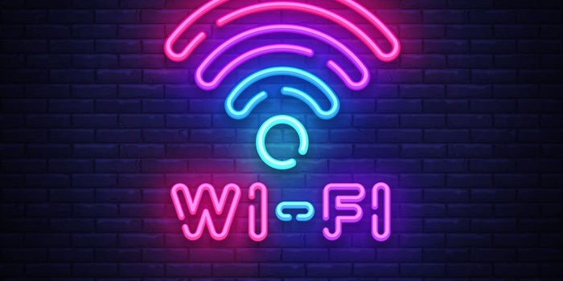
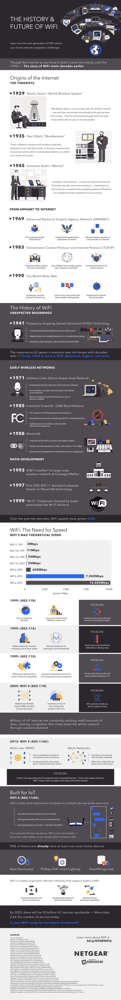
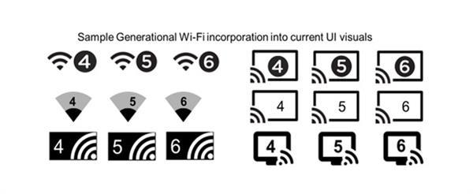
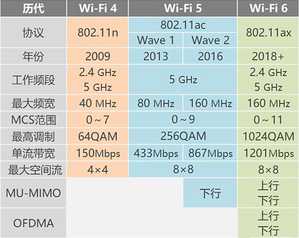
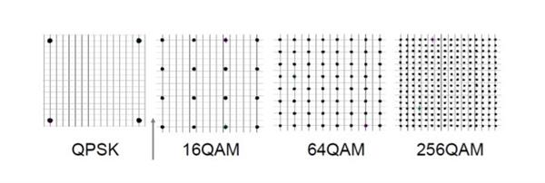
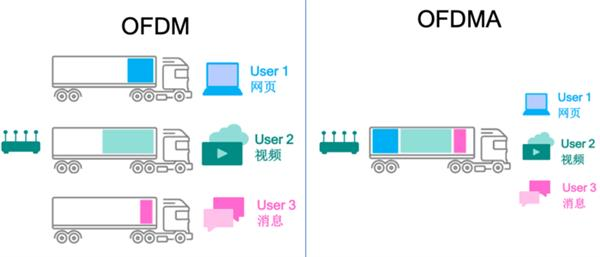
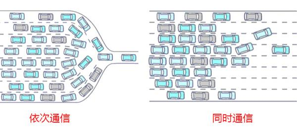
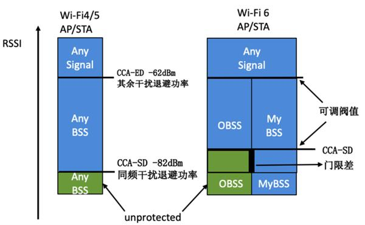

### The History and Future of Wi-Fi (Infographic)

> From: https://www.entrepreneur.com/article/335044
> June 10, 2019 

The average household has five internet connected devices, and the more people in the household the more connected devices there are on a network. Current Wi-Fi technology only connects to one device at a time, sending and receiving small packets of information before moving to the next device. The result is a slower overall connection as a Wi-Fi router struggles to keep up with all the internet-of-things devices modern families can’t live without. Wi-Fi6 is now rolling out and it will be capable of connecting to multiple devices at a time, greatly improving the speed of connected devices.

The history of Wi-Fi goes back much farther than you think. Developments in the technology that led to wireless internet were theorized by Nikola Tesla in 1929 when he predicted people would one day be able to communicate with each other wirelessly in an instant with devices that could fit inside a vest pocket.

Hedy Lamarr created and patented the Frequency Hopping Spread Spectrum technology in 1941, which skipped signals over multiple frequencies in a predetermined pattern. Her technology was used to guide torpedoes without being detected during WWII, but it wasn’t until decades later the technology was used for Wi-Fi, Bluetooth, Zigbee and more.

It has taken decades of smaller developments, such as intranet and internet, ISM Band, WaveLAN and more to get to the point where there are now multiple devices that depend on a steady connection to the internet. Now there are internet connected doorbells, air conditioners, light switches and more. Thanks to Wi-Fi6, these devices are going to be running much more smoothly with less interference to other devices.

Learn more about the [history and future of WiFi](https://www.netgear.com/landings/history-of-wifi/) from the infographic below.

## Wi-Fi 6来了

> https://www.cnbeta.com/articles/tech/857747.htm

> 2019年06月16日

去年10月初，Wi-Fi联盟将基于802.11ax标准的Wi-Fi正式纳入正规军，成为第六代Wi-Fi技术，并借着推广802.11ax的机会，将Wi-Fi规格重新命名，新标准802.11ax改名为Wi-Fi 6。不仅改了命名规范，在Wi-Fi设备网络连接方面，也采用了新图标。

当然，Wi-Fi 6的新并不仅仅体现在图标上而已。这里，我们给大家汇总了一下：

**Wi-Fi 4（11n）**诞生于2009年，凭借40MHz频宽与MIMO技术，将Wi-Fi理论带宽从11a/g的54Mbps升至600Mbps（150Mbps x 4条空间流），且并11n同时支持2.4G和5G双频段，完美取代旧标准。

**Wi-Fi 5（即11ac）**诞生于2013年。最初版本（Wave 1）凭借80MHz频宽，将WiFi单流带宽提升至433Mbps；到了2016年第二版（Wave 2）借鉴部分11ax特性，将频宽再次翻倍到160MHz。但值得注意的是，Wi-Fi 5只支持5G频段。

**Wi-Fi 6（11ax）**同时支持2.4G和5G频段，是真正意义上的第六代Wi-Fi迭代标准。未来，无疑将取代市面上的11n和11ac产品。此外，Wi-Fi 6还带来了完整版的MU-MIMO（支持8个终端上行/下行MU-MIMO），同时引入OFDMA技术，实现与MU-MIMO互补的另外一种并行传输能力，而且比MU-MIMO更灵活更实用。

### Wi-Fi 6到底厉害在哪？

与前几代Wi-Fi技术相比，Wi-Fi 6为我们带来了更极致的用网体验与更大的容量；不仅如此，它还将助力物联网发展，同时结合AR/VR、云计算、人工智能等诸多创新技术，渗透进各行业，更好地服务于客户的业务创新。

**首先，Wi-Fi 6带来了速率上的大幅提升。**哪些因素与Wi-Fi速率有关呢？如公式“Wi-Fi理论带宽=(符号位长×码率×数据子载波数量)×(1/传输周期)×空间流数”所示，速率提升主要由调制方式、数据子载波数量、码率、传输周期和空间流等几个指标共同决定。

其中，调制方式决定无线信号子载波单个符号的数据密度，在相同频宽下，使用更高阶的调制技术就能实现更高速率的提升，而**Wi-Fi 6采用便是更高阶的调制编码方案1024-QAM**（Wi-Fi 5采用的是256-QAM），使其最大连接速率提升至9.6Gbps。

此外，**Wi-Fi 6的“6”还体现在了高密度接入**。其使用了OFDMA（Orthogonal Frequency Division Multiple Access，即正交频分多址），能将无线信道划分为多个子信道（子载波），形成一个个频率资源块，用户数据承载在每个资源块上， 而不是占用整个信道，实现在每个时间段内多个用户同时并行传输。

相较Wi-Fi 5的OFDM方案是按订单发车，不管货物大小，来一单发一趟，哪怕是一小件货物，也发一辆车，这就导致车厢经常是空荡荡的，效率低下，浪费了资源。OFDMA方案则会将多个订单聚合起来，尽量让卡车满载上路，使得运输效率大大提升。

通过了解OFDMA的工作机制可以看到，OFDMA实现了多个用户同时进行数据传输，这增加了空口效率，接下来我们分别看一下上行OFDMA和下行OFDMA的工作原理。

另一个很重要的方面是，Wi-Fi6支持MU-MIMO，也就是我们常说的多用户多入多出，允许路由器一次与多达8个设备同时通信，且同时支持上下行MU-MIMO，无需依次进行通信；相比之下，虽然Wi-Fi 5也支持MU-MIMO，但路由器一次只允许与四个设备通信，且只支持下行MU-MIMO。

这么说可能有点抽象，我们用交通打个比方，就意味着道路由4车道单向扩充为8车道双向，同时多个设备也不再像许多车辆排队等待从一个出口驶出那样，它们可以从不同的道路同时、高效地驶出/驶入，而不再是依次排队行驶，大大提高效率。

不过，这里要说明一下的是，虽然OFDMA和MU-MIMO针对多用户的上下行，都提高了无线的接入密度，但其实两者差别还是很大的。尽管两者均为并行传输解决方案，但既不是迭代关系，也不是竞争关系，而是互补关系。它们的技术原理不尽相同，适用的场景也有所区别，具体使用时需要根据服务的应用类型而定。

**此外，Wi-Fi 6厉害的另一个体现，就是其抗干扰能力。**我们说，Wi-Fi信号无处不在，使得无线之间的干扰也是无处不在的，一方面是来自相邻频段的无线电波叠加引起干扰，会导致数据损坏；另一方面，是同频干扰，虽不会损坏数据却会是竞争开销增加。

表面上看，造成这些干扰的原因是由于我们环境中经常遇到很多孤立安装的AP，因此无线信号出现了很多交叉覆盖从而造成了干扰；但从技术原理层面来看，造成干扰的原因是由于传统802.11技术是使用了载波监听多路访问/冲突避免技术（CSMA/CA）来实现接入控制。

为了解决CSMA/CA技术在密集AP环境中性能低下的问题，Wi-Fi 6提出了一种信道空间复用技术（Spatial Reuse Technique），使用BSS（Basic Service Set，基础服务集合）着色位（Color Bit）来标识这个数据帧属于哪个BSS，因此也被称作“BSS着色”（BSS coloring）技术。

通过“BSS着色”技术，无线设备就能通过新增的着色位来识别来无线报文是来自BSS还是OBSS(0verlapping Basic Service Sets,重叠基本服务集)的信号，这样就能利用提升BSS之间的CCA-SD（Clear Channel Assessment Signal Detection）的门限，动态的降低BSS内部的CCA-SD门限来实现对OBSS相应数据帧的忽略。

之所以说**Wi-Fi 6可以助力物联网的发展，原因在于其支持TWT（Target Wakeup Time，即目标唤醒时间）技术**。其允许AP规划与设备的通信，协商什么时候和多久会唤醒发送/接受数据，可将终端分组到不同的TWT周期，减少了保持天线通电以传输和搜索信号所需的时间，意味着减少电池消耗并改善电池续航表现，同时也减少唤醒后同时竞争无线资源的设备数量。

未来，智慧建筑场景中的智能水表，烟感，门禁…智能工厂场景的机床、AGV、出入库扫码设备等多种类型智能设备都可接入Wi-Fi。得益于TWT，每台设备可单独建立"唤醒协议"，终端设备仅在收到自己的"唤醒"信息之后才进入工作状态，而其余时间均处于休眠状态，可以节省高达7倍的电池功耗。

同时，这使得一些需高带宽通信的物联网设备成为可能，比如智能办公设备，TWT可以可以节省高达7倍的电池功耗。但TWT并不是对所有设备都有帮助，例如笔记本电脑需要持续的互联网访问，因此不太可能过多地受益于此功能（或许进入睡眠状态时影响更大），对偶尔需要更新其状态的小型、低功耗设备更有益处。所以说，TWT技术表明了Wi-Fi 6拥抱物联网的决心。

《完》