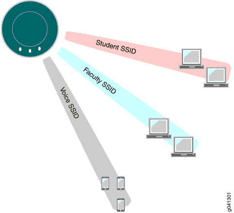
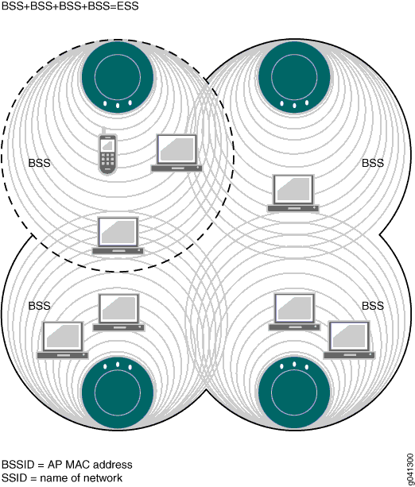

### Understanding the Network Terms SSID, BSSID, and ESSID

> Published: 2013-10-15

> From: http://www.juniper.net/documentation/en_US/network-director1.5/topics/concept/wireless-ssid-bssid-essid.html

The terms BSSID, ESSID, and SSID are all used to describe sections of a wireless network (WLAN)—the three terms have slightly different meanings. As a wireless user you are concerned only with the broadcast SSIDs that let you connect to a wireless network. As an administrator, you also need to keep track of BSSIDs and, to a lesser degree, ESSIDs.

#### An SSID is the Name of a Network

Because multiple WLANs can coexist in one airspace, each WLAN needs a unique name—this name is the service set ID (SSID) of the network. Your wireless device can see the SSIDs for all available networks—therefore, when you click a wireless icon, the SSIDs recognized by device are listed. For example, suppose your wireless list consists of three SSIDs named Student, Faculty, and Voice. This means that an administrator has created three WLAN Service profiles and, as part of each WLAN service profile, provided the SSID name Student, Faculty, or Voice.

Figure 1: Radios can have up to 32 SSIDs

As a WLAN user, you are concerned only with the SSIDs. You select one from the list on your laptop or other device, provide your username and a password, and use the SSID. You might not have access to all SSIDs—the authentication and access privileges are usually different for different WLANs and their associated SSIDs.

#### BSSIDs Identify Access Points and Their Clients

Packets bound for devices within the WLAN need to go to the correct destination. The SSID keeps the packets within the correct WLAN, even when overlapping WLANs are present. However, there are usually multiple access points within each WLAN, and there has to be a way to identify those access points and their associated clients. This identifier is called a basic service set identifier (BSSID) and is included in all wireless packets.

Figure 2: Each Access Point Has Its Own BSS

As a user, you are usually unaware of which basic service set (BSS) you currently belong to. When you physically move your laptop from one room to another, the BSS you use could change because you moved from the area covered by one access point to the area covered by another access point, but this does not affect the connectivity of your laptop.

As an administrator, you are interested in the activity within each BSS. This tells you what areas of the network might be overloaded, and it helps you locate a particular client. By convention, an access point’s MAC address is used as the ID of a BSS (BSSID). Therefore, if you know the MAC address, you know the BSSID—and, because all packets contain the originator’s BSSID, you can trace a packet. This works fine for an access point with one radio and one WLAN configured.

Most often, there are different BSSIDs on an access point for each WLAN configured on a radio. If you have an access point with 2 radios and 32 WLANs configured on each, you would have 64 BSSIDs plus the base access point BSSID. To accommodate the multiple BSSIDs, each access point is assigned a unique block of 64 MAC addresses. Each radio has 32 MAC addresses and supports up to 32 service set identifiers (SSIDs), with one MAC address assigned to each SSID as a basic service set identification (BSSID). All MAC addresses for an access point are assigned based on the base MAC address of the access point.

> Note: The access point MAC address block is listed on a label on the back of the access point.

##### Ad-Hoc Networks Do Not Have a MAC Address

Every BSS needs a BSSID, and using the access point’s MAC address works fine most of the time. However, an ad-hoc network, a network that forwards traffic from node to node, has no access point. When a BSS does not have a physical access point, in an ad-hoc network for example, the network generates a 48-bit string of numbers that looks and functions just like a MAC address, and that BSSID goes in every packet.

#### An ESS Consists of BSSs

An extended basic service set (ESS) consists of all of the BSSs in the network. For all practical purposes, the ESSID identifies the same network as the SSID does. The term SSID is used most often.
