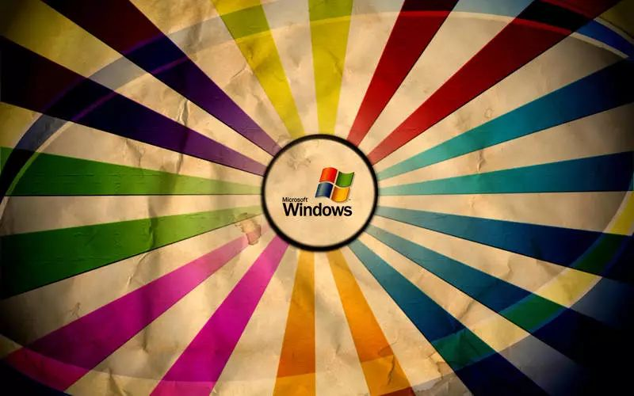
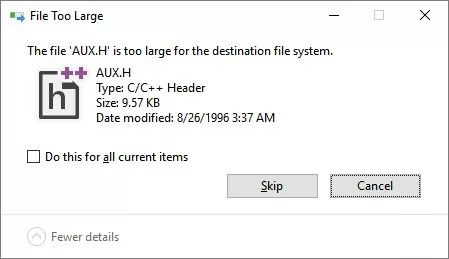
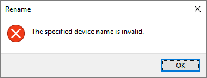
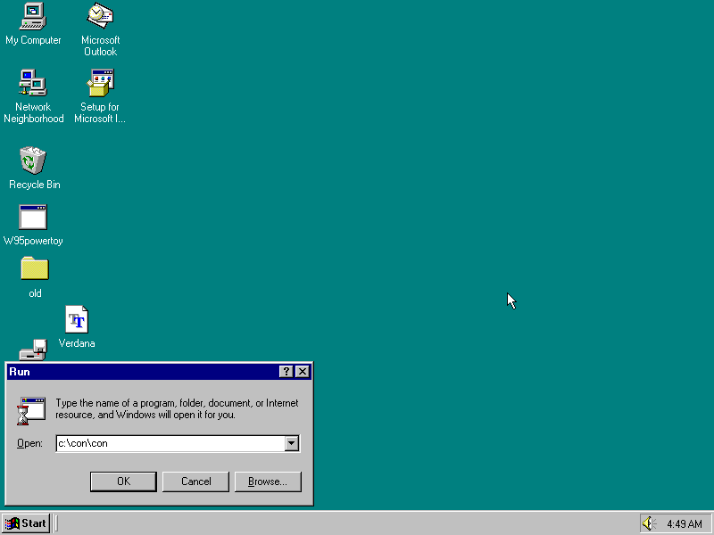
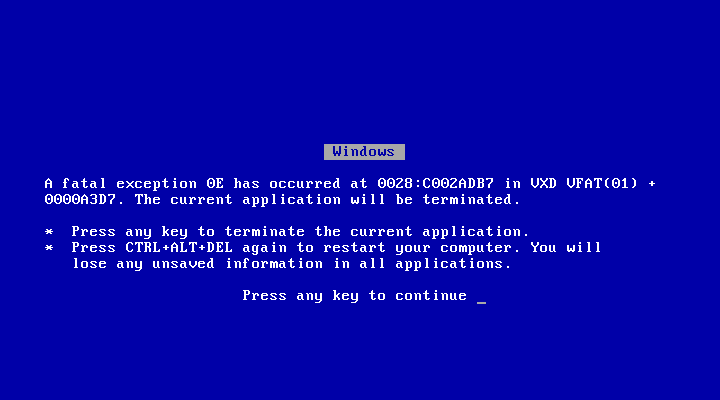
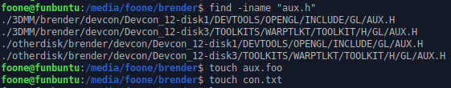

## 微软“黑历史”：一个活了 45 年的愚蠢 Bug！

> 2018年11月10日 18:03:31 CSDN资讯
> 
> 【CSDN编者按】微软于近期推出了Windows 10操作系统。不断压缩的更新周期下，一般而言，系统Bug的存活希望会被很快掐灭，快速迭代。但是本文的作者在Windows 10上从一个USB 3.0 SSD向另一个SSD拷贝文件时却遭遇了一个44年前的bug，他把这个“愚蠢”的Bug分享到了博客上，并且引起了开发者们的回忆热潮。



以下为译文：

现在都2018年了，而这个来自于1974年的错误信息居然还在。最新版本的Windows 10依然有这个限制，而这个bug第一次出现的时候星球大战还没上映，都跟水门事件一样老了。



这个bug出现时，超市里的东西还没有UPC条码，因为UPC还没发明。

这个bug出现时，世界上只有一家电话公司，因为他们还没分家。Ted Bundy还没被抓。Babe Ruth的本垒打纪录还没有被打破。

这个bug出现时，幸运大转轮还没播出，也没人看过Rocky Horror。斯皮尔伯格只是一系列小众电视剧的导演，电影票房也十分糟糕。埃德蒙德·费兹杰罗号货轮还是一堆铁矿石。

### 那么，这个bug究竟是什么？

因为Unix（当时才仅仅5岁）发明了一个很好的点子——“一切皆是文件”，也就是说，你可以用同样的命令和指令读写套接字、管道、控制台等等。

这个点子是由Gary Kildall在1974年想出来的，并应用于 CP/M 系统中。用这个方法有很多方便之处，比如可以从串口拷贝数据到文本文件，或者直接从命令行打印文本文件。

在Unix中，这个点子是通过特殊目录下的特殊文件实现的，比如`/dev/tty`表示控制台，`/dev/lp0`表示第一个打印机等。`/dev/zero`可以提供无限的零，`/dev/random`可以提供随机字节，还有很多！

但有个问题：CP/M是为8位计算机设计的，这些计算机内存很小，也没有硬盘，最多也就有个8寸软驱。目录是什么？还要目录干啥。你换个软盘就行了。

但没有目录，就没办法把所有特殊文件都放在`/dev/`目录下了。所以这些文件实际上被放到了“所有地方”。所以，如果你要打印FOO.TXT，可以执行`PIP LST:=FOO.TXT`，就能把foo.txt拷贝到“文件”LST，而实际上这个就是打印机。

这个命令在任何地方都可以使用，因为根本没有目录！非常简单。

### 那扩展名怎么办？

这里就有问题了：程序喜欢给自己的文件加上正确的扩展名。

所以如果你运行一个程序，它问你“请输入要保存代码的文件名”时，你可以输入`LST`让它直接打印出来，或者输入`PTP`让它输出到磁带（别忘了现在是1974年！）

但是！程序可能会自己在文件名后面加上`.TXT`！`LST.TXT`不是打印机，对吧？

错了，`LST.TXT`也是打印机。这些特殊设备存在于所有扩展名中，这样上面的问题才不会出现。所以，如果`CON`被用来指代键盘，那么`CON.TXT`、`CON.WAT`、`CON.BUG`都是键盘。

额……这确实是个hack，但就是好使，而且这只不过是只有4k内存的微型计算机，谁在乎呢？

### IBM、微软等巨头的加入

70年代末到80年代初CP/M广泛流行。它是最主要的商用操作系统之一。它定义了一套接口，你可以用这套接口在NorthStar Horizon上写CP/M代码，然后放到Seequa Chameleon上运行（注：两者都是计算机的型号）。

由于它缺少图形标准，所以无法进入游戏市场（虽然有一些Infocom的东西），所以主要是用于商用。但它实在太流行了，于是IBM很自然地希望在80年代早期的“个人电脑”项目上使用它。

于是IBM计划在IBM个人电脑发布时支持几种操作系统，其中CP/M是最主要的那个。但CP/M的x86版直到IBM个人电脑发布六个月之后才出现……而且价格是感人的$240，相比之下DOS只要$40。

所以绝大部分用户选择了微软的PC-DOS，这个产品曾经是由Seattle Computer Products开发的一个划时代的新操作系统。微软买下了Tim Paterson的这个项目，并在其基础上开发了PC-DOS（后来改名为MS-DOS）。

Tim Paterson的操作系统叫做“QDOS”，意思是“Quick and Dirty Operation System”——“快速、肮脏的操作系统”。原因基本上是因为CP/M还没有x86版，QDOS就是为了解决CP/M的一些问题而出现的。所以，很多方面都借鉴了CP/M。

其中主要的一点就是借鉴了不使用目录来操作特殊文件的点子，因为在CP/M中这个功能很有用。于是QDOS和PC-DOS 1.0中也有AUX、PRN、CON、LPT等等！

### 结果问题来了

1983年随着IBM XT一起发行的PC-DOS 2.0中的大部分被微软重写了。因为IBM XT带硬盘，所以PC-DOS需要支持目录。显然，一个10MB的硬盘需要目录来组织文件！

但问题来了：用户在两年前PC DOS 1.0时就开始使用这些特殊文件名了。许多软件都用了这些特殊文件名！各种批处理文件也需要它们。所以，尽管有了目录之后微软可以建一个`C:\DEV`目录，但他们没有这样做。

这种牺牲可用性来满足向后兼容性的事情绝不是最后一次。特殊文件依然适用于所有目录，所有扩展名。所以`DIR > LPT`来打印目录的技巧不会由于你从`A:\`切换到了`C:\DOS\`就不能用了。

但是，我们现在早就不用DOS 2.0了……Windows 95是基于DOS的，所以很自然地继承了这一行为。（当然Windows 1/2/3也继承了，但与它们相比，Win95才是真正意义上的操作系统。）

但是，我们现在早就不用Windows 95了！现在的Windows是基于Windows NT的，不是Win95。

但Windows NT想要与DOS/Windows程序兼容。而XP合并了两条产品线，所以这些特殊文件依然存在——这时距离这个bug出现已经过去44年了！

你可以自己试试看！打开文件管理器，新建一个文本文件，命名为con.txt、aux.txt、prn.txt。

但Windows不会让你这么干的：



这都是因为Gary Kiddal说“特殊文件表示硬件设备！Unix的这个点子很不错。我要把这个点子实现在我的玩具操作系统中”……那一年出生的人的孩子都长大成人了，但我们仍然不能建con.txt……

微软给出的官方列表是：

```
CON, PRN, AUX, NUL, COM1, COM2, COM3, COM4, COM5, COM6, COM7, COM8, COM9, LPT1, LPT2, LPT3, LPT4, LPT5, LPT6, LPT7, LPT8, LPT9
```

> https://docs.microsoft.com/en-us/windows/desktop/fileio/naming-a-file

更有意思的是，在Win95上访问`C:\con\con`（或`C:\aux\aux`）会直接导致蓝屏。即使在1995年这也非常荒谬，因为这个bug已经21岁了！你能想象一个错误的设计会如此长寿么？





至于为什么我发现了这个无法拷贝文件的bug……这些特殊文件名是在操作系统级别实现的，而不是文件系统级别。所以这些文件名完全是合法的NTFS文件名，而我在Linux下使用这些NTFS文件系统。

而且显然OS/2也没有实现这些特殊文件名，因为IBM在OS/2 devcon磁盘上发布的一些opengl头文件中有个文件叫AUX.H。



所以我今天想把这个NTFS盘备份到主PC上然后惊喜地发现，我没办法拷贝所有文件，而造成这个问题的bug的年龄比所有读者都大……

### 内容纠错

1.CP/M对于特殊文件的处理方式其实不像我说的那么简单，所以我一直也没学会，也有可能学会了然后忘了。其实特殊文件后面要有个冒号，就跟盘符一样。比如PRN:是打印机，而PRN不是。

2.CP/M并不像DOS那样在操作系统层次实现！CP/M中是在PIP（文件复制）命令中实现的。所以没办法像DOS那样让程序直接保存到PRN.TXT进行打印。我可能没说清楚，我想说的是DOS，没有暗示CP/M也能这样做。

3.PC DOS 1其实没有重定向或管道，所以没办法像我说的那样做重定向。我忘记了。这些功能是1983年在PC DOS 2.0中加入的。但PC DOS 1的确支持从特殊文件中拷贝或拷贝到特殊文件，所以我说的大方向是对的，虽然例子搞错了。

不论如何，感谢大家的回复！我没想到这篇文章能这么火，其实它只是我在遇到一个44年的bug之后感到很无力而已。

而且我想重申，这篇文章并不是想说“Windows很垃圾”。一般来说，向后兼容是很好的。实际上我希望看到更多向后兼容。

我只是觉得，在Windows 10上从一个USB 3.0 SSD向另一个SSD拷贝文件时，遇到个44年前的bug很奇妙。

就像你在宇宙空间站中被马踢了一样。

### 开发者的看法

Hacker News上的很多开发者对于这个45岁的bug发表了自己的看法。

#### 评论1：

好怀念那时的互联网……当时我们经常搜索21端口，就能找到很多开放了匿名FTP权限的机器，其中很多机器都是Windows的。

我们在这些匿名FTP上经常使用的“技巧”是：用这些特殊文件名创建一些嵌套的目录。在FTP服务器上，你可以创建这些目录，也可以访问它们（只要你知道正确的路径），但Windows下这些目录会导致错误，或者访问时会造成系统崩溃。再加上你可以创建文件名中只有空格的目录，所以可以在匿名FTP上放很多东西而不被管理员发现。

#### 评论2：

我们高中的实验室中用的是Windows For Workgroups 3.11，我们用Alt+255（这个字符在DOS下像个空格，但在Windows下是隐藏的）来隐藏Doom、Descent还有很多其他DOS游戏的安装文件。

实验室管理员禁用了Ctrl+C和Ctrl+Break来防止有人退出DOS下的登录提示符直接进入C:，但我不知怎么发现了Alt+3也能输入同样的字符，起到同样的作用。

只有一次有个老师对我喊“在实验室里待了太长时间”，但我从来没被抓到过。我觉得管理员（上了点年纪的编程和数学老师）应该知道我们在干什么。

#### 评论3：

好玩的是那些“COM”、“LTP”等后面加数字的……或者至少加上个像是数字的Unicode，所以COM²跟COM2一样不能用。

这种设备映射是在Win32层进行的，而不是NT内核上，所以你可以使用"verbatim path syntax"来越过这些规则。例如，`C:TempCOM2.TXT`是特殊设备，而`\?C:TEmpCOM2.TXT`就是个普通文件，完全可以正常读写……但像文件管理器这种没使用verbatim path syntax的程序就会报错。


From: https://blog.csdn.net/csdnnews/article/details/83965147

原文：https://threadreaderapp.com/thread/1058676834940776450.html

## Thread by @Foone: "It is 2018 and this error message is a mistake from 1974. This limitation, which is still found in the very latest Windows 10, dates back to […]"

It is 2018 and this error message is a mistake from 1974.
This limitation, which is still found in the very latest Windows 10, dates back to BEFORE STAR WARS. This bug is as old as Watergate.


When this was developed, nothing had UPC codes yet because they'd just been invented.
Back when this mistake was made, There was only one Phone Company, because they hadn't been broken up yet. Ted Bundy was still on the loose. Babe Ruth's home run record was about to fall.

When this bug was developed, Wheel of Fortune hadn't yet aired. No one had seen Rocky Horror. Steven Spielberg was still a little-known directory of TV films and one box-office disappointment. SNL hadn't aired yet. The Edmund Fitzgerald was still hauling iron ore.

**WHEN THIS STUPID MISFEATURE WAS INVENTED, THE GODFATHER PART II HAD JUST OPENED IN THEATERS.**

So, why does this happen? So Unix (which was only 5 years old at this point) had the good idea of "everything is a file" which mean you could do things like write to sockets, pipes, the console, etc with the same commands and instructions.

This idea was brought into CP/M by Gary Kiddal in 1974.

You could do neat things with it like copy data off the serial port into a text file, or print a textfile right from the command line!

This is done in unix by having special files existing in special folders, like /dev/tty for the console or /dev/lp0 for the first printer.

You can get infinite zeros from /dev/zero, random bytes from /dev/random, etc!

but here's the problem: CP/M is designed for 8-bit computers with very little memory, and no hard drives. At best you've got an 8" floppy drive.

So directories? you don't need 'em. Instead of directories, you just use different disks.

but without directories you can't put all your special files over in a /dev/ directory.

So they're just "everywhere", effectively. 

So if you have FOO.TXT and need to print it, you can do "PIP LST:=FOO.TXT" which copies foo.txt to the "file" LST, which is the printer.

and it works where ever you are, because there are no directories! it's simple. 

but what about extensions? Here's the problem: programs like to name their files with the right extension.

so if you're running a program and it goes "ENTER FILENAME TO SAVE LISTING TO" you could tell it LST to print it or PTP to punch it out to tape (cause it's 1974, remember?)

but the program might try to put .TXT on the end of your filename! LST.TXT isn't the printer, right?
Nah. It is. These special devices exist at all extensions, so that this works. so if "CON" is reserved to refer to the keyboard, so is CON.TXT and CON.WAT and CON.BUG

Eh. It's a hack, but it works, and this is just on some little microcomputers with 4k of ram, who cares?

Well CP/M caught on widely through the late 70s and early-80s. It was one of the main operating systems for business use. It defined an interface which meant you could write CP/M code on a NorthStar Horizon and run it on a Seequa Chameleon.

The lack of a portable graphics standard kept it out of the games market for the most part (though there are Infocom releases) so it was mainly business users.

But it was big, so naturally IBM wanted it for some "PC" project they were doing in early 1980

So IBM intended to launch the IBM PC with several operating systems, and were expecting CP/M to be the "main" one. But CP/M for the x86 didn't come out until 6 months after the IBM PC launched... and it cost 240$ vs 40$ for DOS.

so the vast majority of users ended up using Microsoft's PC-DOS, which was an evolution of a new OS developed by Seattle Computer Products. 

MS purchased Tim Paterson's project and developed it into PC-DOS (which later became MS-DOS, if you're not aware)

Tim Paterson's OS was called "QDOS", for "Quick and Dirty Operating System". It was basically written because CP/M didn't have an x86 version yet, and an attempt to solve some of the limitations of CP/M.

It was definitely inspired by CP/M, in a lot of ways.

One of those main ways was keeping the idea of special files and no directories, because that was a useful feature of CP/M. 

So QDOS and PC-DOS 1.0 have AUX, PRN, CON, LPT, etc, too!

For PC-DOS 2.0 released in 1983 for the new IBM XT, Microsoft significantly revamped PC-DOS. The IBM XT featured a hard drive, so PC-DOS needed directories support.

You need them to keep your massive 10mb hard drive organized, obviously!

But here's the problem: Users have been using these special files since PC DOS 1.0 release two years earlier. Software has been written that uses them! batch files have been written that support them.

with directories, Microsoft could now make a C:\DEV folder... but they didn't.

For what wouldn't be the last time, Microsoft sacrificed sanity for backwards compatibility: 

Special files are in EVERY DIRECTORY with EVERY EXTENSION. 

So your "DIR > LPT" trick to print the directory listing doesn't break because you're in C:\DOS instead of A:\

But we're not running DOS 2.0, of course... 

And when Windows 95 was released, it was built on top of DOS. So it naturally inherited this behavior. (Windows 1/2/3 similarly did, but Win95 was much more an OS than they were)

But hey, we're not running Windows 95 anymore! The current branch of windows is based on Windows NT, not Win95. 

But Windows NT wanted compatibility with DOS/Windows programs. And XP merged the two lines.

So these special files still work, FORTY FOUR FUCKING YEARS LATER

Feel free to try it yourself! Open explorer, do "new text file", and name it con.txt

aux.txt

prn.txt

it'll tell you NOPE


So because of Gary Kiddal going "Special files representing hardware devices! That's a neat idea, Unix. I'll borrow that idea and try to hack it into my toy-computer OS" so long ago that people born that year can have children old enough to drink... we can't name con.txt

Microsoft gives the official list here:

```
CON, PRN, AUX, NUL, COM1, COM2, COM3, COM4, COM5, COM6, COM7, COM8, COM9, LPT1, LPT2, LPT3, LPT4, LPT5, LPT6, LPT7, LPT8, and LPT9
```

For extra fun, accessing C:\con\con (or C:\aux\aux) on win95 would cause it to bluescreen instantly. That was hilarious back in 1995, because it was a 21-year-old bug! Imagine some misdesign hanging on that long?


And if you want the backstory for I got into this mess where I have a file I can't copy:

These special-device names are implemented at the OS level, rather than the filesystem level. So they're perfectly valid NTFS filenames, and I was using an NTFS drive in linux.

And apparently OS/2 didn't implement these special names either, cause IBM shipped some opengl headers as AUX.H on one of the OS/2 devcon disks.


So today I was trying to backup this NTFS drive onto my main PC and WHOOPS CAN'T COPY ALL FILES CAUSE OF BUGS OLDER THAN MOST PEOPLE READING THIS

OK sorry I was stuck in hospitals and/or asleep since I wrote this.

A couple follow ups:

1. The CP/M inventor's name is "Gary Kildall", not "Gary Kiddal". 
Sorry, I posted this at 5am after being in the hospital for like... 8 hours?
2. CP/M actually didn't do these special names as simply as I described them, which is a fact I either never learned or had since forgot.
It actually required them to be followed by a colon, as if they were a drive name.
So PRN: is the printer, PRN is not.
3. CP/M didn't implement these at the OS layer like DOS did! They were just included in PIP, the file copy command. So you couldn't do the DOS trick of telling a program to save to PRN.TXT to print it.
I didn't mean to imply CP/M did, just DOS, but I don't think I made this clear
4. PC DOS 1 didn't actually have redirection or pipes, so you couldn't do the redirects I suggested. I forgot that. They were added in PC DOS 2.0 in 1983.

PC DOS 1 did support copying to/from special files though, so my general point was correct, even if my example was confusing

In any case, thanks for the response this thread got! I wasn't expecting it to blow up as big as it did, this was really just me being way too tired and rambly and being amazed at getting home to an error message caused by a decision from 44 years ago.

and if it wasn't clear, my intent was never to be like "WINDOWS SUCKS" with this. Backwards compatibility is, in general, a good thing. In fact, I'd like MORE backwards compatibility, not less.

But I was just flabbergasted at hitting a bug from 44 years ago, while running Windows 10 and copying from a USB 3.0 SSD to another SSD.

It's like you're living on a space station and get trampled by a horse.
tl;dr:
