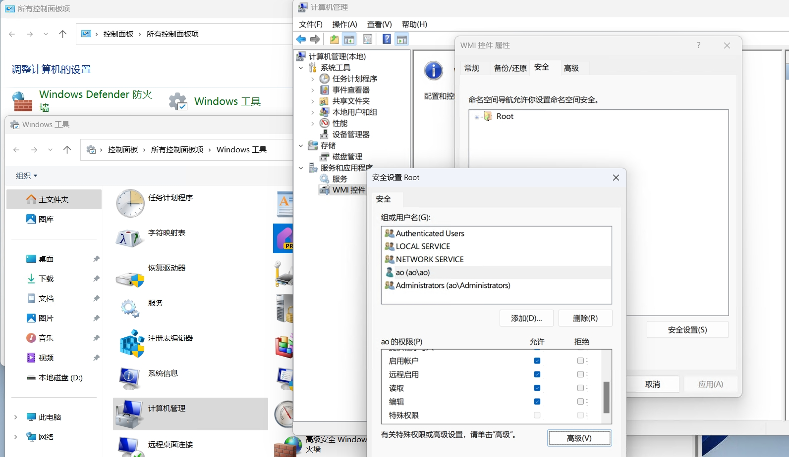
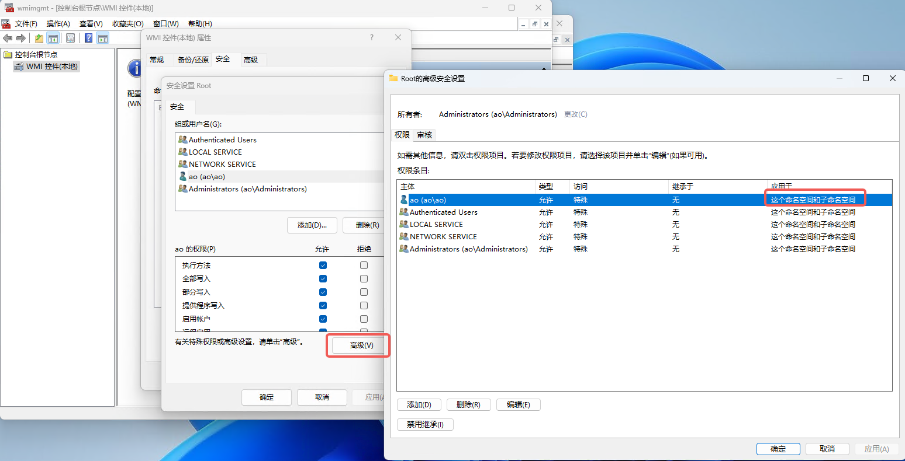
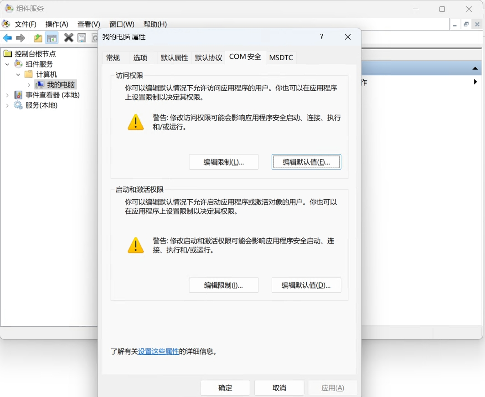
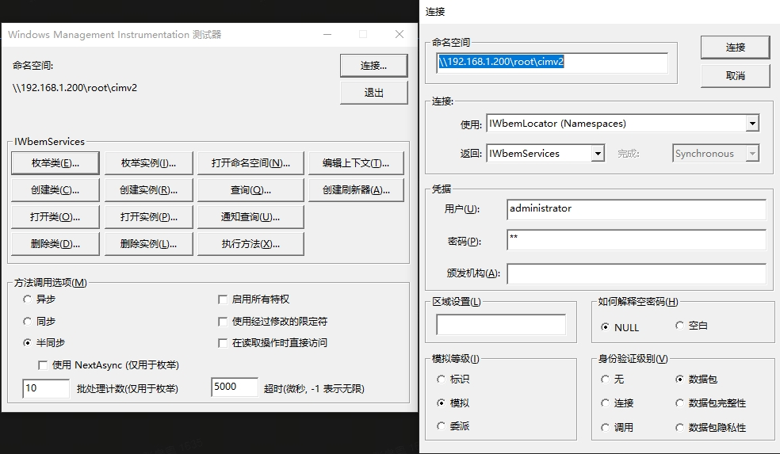

# WMI简介

WMI（Windows Management Instrumentation）是微软Windows操作系统中的一项核心技术，它提供了一个统一的接口，用于访问和管理系统硬件、软件、操作系统、应用程序等信息。WMI是Windows操作系统的一部分，基于Web-Based Enterprise Management（WBEM）标准，提供了一种高效的方式来执行系统管理任务。

WMI（Windows Management Instrumentation, Windows管理规范）是Windows 2000/XP管理系统的核心，属于管理数据和操作的基础模块。设计WMI的初衷是达到一种通用性，通过WMI操作系统、应用程序等来管理本地或者远程资源。它支持分布式组件对象模型（DCOM，Distribution Components Object Model）和Windows远程管理（WinRM），用户可通过WMI服务访问、配置、管理和监视Windows所有资源的功能。对于其他的Win32操作系统来讲，WMI是一个非常不错的插件，同时也是测试人员在攻防实战中的一个完美的“无文件攻击”入口途径。

注意：**虽然WMI仍然存在并可以使用，但Microsoft正在推动更现代的管理工具和接口。对于新开发的应用，建议考虑使用PowerShell和CIM。**


## Windows中配置WMI远程访问

Windows默认会启用WMI服务，若希望远程访问，则需要按文档[在 Windows 服务器上配置 WMI](https://www.site24x7.cn/help/admin/adding-a-monitor/configuring-wmi.html)配置防火墙。

经过实验Windows内置Administrator账户设置密码后，允许使用该远程管理主机。

不过，如果要使用普通管理员账户远程使用WMI管理主机，那么需要为该用户添加“WMI 控件”和“组件服务”的访问权限。

否则即使用户名和密码正确，远程访问时也会出现如下错误：

```
wmic /node:192.168.1.200 /user:ao cpu get Caption,DeviceID
输入密码:*

节点 - 192.168.1.200
错误:
描述 = 拒绝访问。
```

设置成功后，可以使用命令`wmic /node:192.168.1.200 /user:ao cpu get DeviceID,Name,NumberOfCores,ProcessorId,SystemName,ThreadCount`查看远程主机指定CPU信息列

```
wmic /node:192.168.1.200 /user:ao cpu get DeviceID,Name,NumberOfCores,ProcessorId,SystemName,ThreadCount
Enter the password :*

DeviceID  Name                                            NumberOfCores  ProcessorId       SystemName  ThreadCount
CPU0      11th Gen Intel(R) Core(TM) i5-1135G7 @ 2.40GHz  4              BFEBFBFF000806C1  AO          8
```

查看本机CPU所有信息的命令`wmic cpu get`


### 添加“WMI 控件”访问权限

1. 转到控制面板 -> 管理工具 -> 计算机管理。Windows11的查找路径为 控制面板 -> Windows 工具 -> 计算机管理。
2. 在计算机管理屏幕中，展开服务和应用程序。
3. 右键单击WMI 控件，然后单击属性。
4. 在WMI 控件属性屏幕中，转到安全选项卡。
5. 单击安全按钮。
6. 在组或用户名下，选择将请求 WMI 数据的用户，然后单击添加。
7. 在管理员权限下，确保为允许选中远程启用。




### 添加“组件服务”访问权限

DCOM（分布式组件对象模型）是WMI远程连接的基础。修改设置该组件的方法如下：

1. 转到控制面板 -> 管理工具 -> 组件服务。Windows11的查找路径为 控制面板 -> Windows 工具 -> 组件服务。或者直接Windows + R 快捷键使用`dcomcnfg`命令打开“组件服务”
2. 展开“组件服务”->“计算机”->“我的电脑”，然后右键点击“我的电脑”并选择“属性”。
3. 在“COM 安全”选项卡中，检查“启动和激活权限”以及“访问权限”，确保你的用户账户或相应的组被添加到列表中，并具有适当的权限。



## WMI工具

Windows本身提供了两个系统自带的WMI工具供用户使用，包括WMIC.exe和WBEMTest.exe。

wmic.exe是一款主要用于与WMI交互的命令行管理工具，它不但可以管理本地计算机，还能够在权限充分的情况下管理域控制器中的其他计算机。`WMIC`是Windows自带的一个功能，计算机只要支持 WMI即可使用 WMIC。因功能强大以及在 Windows 中免安装WMIC在内网渗透中扮演着重要的角色。

`WBEMTEST`是Windows自带的一个与WMI基础结构交互的图形化工具，它支持任何Windows 系统，在“运行”窗口中输入 wbemtest 并单击“确认”按钮即可打开。在弹出的“连接”窗口中选择命名空间(WBEMTEST不会浏览命名空间，需要我们手动选择以连接到指定命名空间)，默认选择root\cimv2。这样，通过WBEMTEST工具就可以进行枚举对象实例、查询、创建和修改WMI类与对象等操作。注意：WBEMTEST 的一个限制是它不会浏览 WMI 命名空间 ， 你需要知道要连接的位置。 `ROOT\CIMV2` (所有 Windows 系统) 、`ROOT\CCM` (Configuration Manager客户端) 和 `ROOT\SMS\site_<站点代码>` (Configuration Manager站点服务器) 是一些有用的起点。



### DCOM

DCOM(分布式组件对象模型)是微软基于COM(组件对象型)推出的一系列概念和程序接口。通过该技术，在局域网、广域网甚至Internet 上不同计算机的对象之间能够过行通信，从而在位置上达到分布性，满足客户和应用的需求。
在了解 DCOM 之前，我们先简单介绍一下 COM 技术。COM 是微软的一套软件组件口标准，定义了组件和本地客户端之间互相作用的方式。它使组件和客户端不需要任何中介组件就能相互联系。而DCOM是COM的扩展，使用DCOM可以不受本地限制，通过远程过程调用(RPC)技术实现客户端程序实例化和访问远程计算机的COM对象。DCOM为分布在网络不同节点的两个COM组件提供了互相操作的基础结构。它增强了COM的分布处理性能，支持多种通信协议，加强了组件之间通信的安全保障。DCOM在组件中的作用为:作为PC间通信的PCI和ISA总线，负责各种组件之间的信息传递。如果没有DCOM，则达不到分布式计算环境的要求。


## WMI的用途：

系统信息获取：WMI可以用来获取系统的各种信息，如CPU使用率、内存使用情况、磁盘空间、网络配置等。

硬件管理：WMI能够提供硬件相关的详细信息，包括CPU型号、内存大小、硬盘信息等。

软件管理：通过WMI，可以查询安装的软件列表、软件版本、补丁状态等。

事件日志：WMI可以访问Windows事件日志，包括应用程序日志、安全日志和系统日志。

网络管理：WMI提供了网络配置和状态的详细信息，可以用于网络监控和管理。

性能监控：WMI可以用来监控系统性能，如CPU负载、内存使用、磁盘I/O等。

远程管理：WMI支持远程管理，允许管理员从一台计算机上远程管理网络上的其他计算机。

脚本和自动化：WMI与PowerShell紧密集成，可以通过脚本自动化各种管理任务。

扩展性：WMI是一个可扩展的平台，第三方开发者可以创建自己的WMI提供程序来扩展其功能。

WMI的使用通常涉及到WMI查询语言（WQL，Windows Management Instrumentation Query Language），这是一种类似于SQL的查询语言，用于查询WMI数据库中的信息。此外，WMI还可以通过各种编程接口（如COM、.NET Framework等）进行访问和操作。


## WMI的前世今生

WMI的起源：WMI最初是作为Windows 2000的一部分引入的，旨在提供一个统一的接口，用于管理系统资源。它允许管理员和开发人员查询系统信息，监控事件，并执行管理任务。

WMI的架构：WMI基于分布式管理任务组（DMTF）的Web-Based Enterprise Management (WBEM)标准，支持Common Information Model (CIM)。WMI的架构包括WMI服务（Winmgmt.exe），WMI存储库（WMI Repository），以及WMI提供者（Providers）。

WMI的发展：随着Windows操作系统的发展，WMI也在不断增强。从Windows 2000到Windows XP，再到Vista、Windows 7以及后续版本，WMI的功能和性能都得到了显著提升。

WMI与PowerShell：随着PowerShell的引入，WMI的管理功能得到了进一步的扩展。PowerShell提供了WMI相关的命令和模块，使得WMI的使用更加方便和强大。

WMI的未来：尽管WMI是一个强大的工具，但微软也在逐步推广PowerShell作为系统管理的首选方法。PowerShell提供了更现代的接口和更广泛的应用场景。WMI也逐渐退居幕后。

## Powershell对WMI 和 CIM支持

默认情况下，Windows PowerShell 附带用于处理其他技术（如 Windows Management Instrumentation（WMI）的 cmdlet。 WMI cmdlet 已弃用，在 PowerShell 6+ 中不可用，但在 Windows PowerShell 上运行的较旧脚本中可能会遇到这些 cmdlet。 对于新开发，请改用 CIM cmdlet。

原文链接：https://blog.csdn.net/Javachichi/article/details/139226115

(PowerShell 101 第 7 章 - 使用 WMI)[https://learn.microsoft.com/zh-cn/powershell/scripting/learn/ps101/07-working-with-wmi?view=powershell-7.4]

[在 Windows 服务器上配置 WMI](https://www.site24x7.cn/help/admin/adding-a-monitor/configuring-wmi.html)

[Windows WMI详解](https://blog.csdn.net/2401_83947434/article/details/137730527)

[Windows安全基础——Windows WMI详解](https://blog.csdn.net/wangluoanquan111/article/details/138273982)
